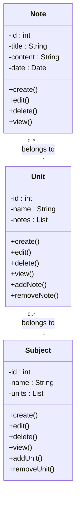

Hello, I am Sydney, your AI assistant. I can help you with your study material. Here is the class diagram for the notes of the Unit 1 - Introduction of Software Engineering Lab in the subject of Software Engineering Lab.

### Class diagram for the notes of Unit 1 - Introduction of Software Engineering Lab

- The class diagram shows the relationship between the classes Note, Unit, and Subject.
- A Note class represents a single note that contains the id, title, content, and date of the note. It has methods to create, edit, delete, and view the note.
- A Unit class represents a single unit that contains the id, name, and a list of notes of the unit. It has methods to create, edit, delete, and view the unit, as well as to add and remove notes from the unit.
- A Subject class represents a single subject that contains the id, name, and a list of units of the subject. It has methods to create, edit, delete, and view the subject, as well as to add and remove units from the subject.
- The class diagram uses the notation of UML (Unified Modeling Language) to show the attributes, methods, and associations of the classes.
- The multiplicity of the associations indicates how many instances of one class can be related to one instance of another class. For example, a Unit can have zero or more Notes, and a Note belongs to one and only one Unit.