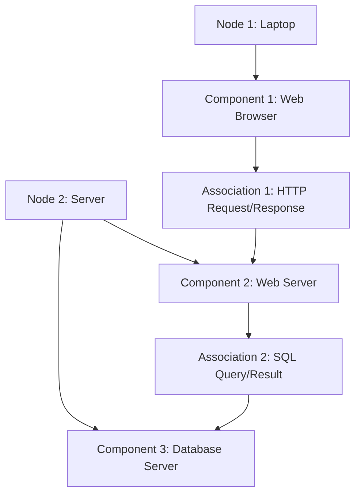

### Deployment diagram for the notes of the Unit 1 - Introduction of Software Engineering Lab

- A deployment diagram is a type of UML diagram that shows the physical arrangement of the components of a software system and their relationships.
- A deployment diagram consists of nodes, components, and associations.
- Nodes are the physical devices or locations where the components are deployed or executed.
- Components are the executable units of software that provide specific functionality or services.
- Associations are the connections or dependencies between the nodes and components.
- A deployment diagram can be used to model the hardware and software architecture of a system, the distribution of the system across different platforms, the communication and networking aspects of the system, and the performance and scalability of the system.

- A possible deployment diagram for the notes of the Unit 1 - Introduction of Software Engineering Lab is shown below:

- The deployment diagram shows that the notes are stored in a database server (Component 3) on a server (Node 2), and are accessed by a web browser (Component 1) on a laptop (Node 1) through a web server (Component 2) using HTTP and SQL protocols. The associations show the direction and type of communication between the components.