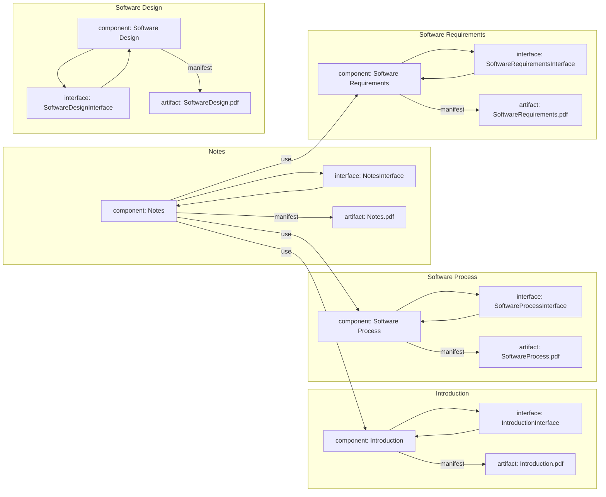

# Component Diagram for the Notes of the Unit 1 - Introduction of Software Engineering Lab

- A component diagram is a type of UML diagram that shows the physical components and their dependencies in a software system  .
- A component can be a software module, a hardware device, a business unit, or any other entity that has a well-defined interface and behavior  .
- A component diagram can be used to verify that the system's required functionality is acceptable, to communicate the system's architecture to the stakeholders, and to construct executable systems through forward and reverse engineering .
- A component diagram consists of the following elements  :
  - Component: A rectangle with two smaller rectangles on the left side, representing the component's interface and implementation. The component's name is written inside the rectangle, optionally preceded by the keyword "component".
  - Interface: A circle or a lollipop, representing the component's provided or required interface. The interface's name is written next to the circle, optionally preceded by the keyword "interface".
  - Dependency: A dashed arrow, representing the dependency between two components or interfaces. The arrow points from the dependent element to the independent element, optionally labeled with the stereotype "use" or "call".
  - Association: A solid line, representing the association between two components or interfaces. The line can have optional multiplicity and role labels at both ends, indicating the number and the name of the instances involved in the association.
  - Delegation: A dashed line with an open arrowhead, representing the delegation of a component's required interface to another component's provided interface. The arrow points from the delegating component to the delegated component, optionally labeled with the stereotype "delegate".
  - Generalization: A solid line with a closed arrowhead, representing the inheritance relationship between two components or interfaces. The arrow points from the subclass to the superclass, optionally labeled with the stereotype "extend" or "implement".
  - Realization: A dashed line with a closed arrowhead, representing the realization relationship between a component and an interface. The arrow points from the component to the interface, optionally labeled with the stereotype "realize".
  - Manifestation: A dashed line with an open arrowhead, representing the manifestation relationship between a component and an artifact. The arrow points from the component to the artifact, optionally labeled with the stereotype "manifest".
  - Artifact: A rectangle with a folded corner, representing a physical file or document that is part of the system. The artifact's name is written inside the rectangle, optionally preceded by the keyword "artifact".

- The following is an example of a component diagram for the notes of the unit 1 - introduction of software engineering lab, based on the assumption that the notes are composed of four modules: introduction, software process, software requirements, and software design .

