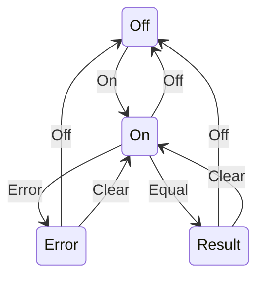

# State Chart Diagram for the Notes of the Unit 1 - Introduction of Software Engineering Lab

- A state chart diagram is a type of behavioral diagram in the Unified Modeling Language (UML) that shows the transitions between various states of an object or a system .
- A state is a condition in which an object exists and it changes when some event is triggered .
- A state transition is a link between two states that indicates that the object or the system can change from one state to another when a certain condition is satisfied .
- A state chart diagram can be used to model the behavior of a class, a subsystem, a package, or even an entire system .
- A state chart diagram can also show the actions or activities that are performed in each state, the events that trigger the transitions, and the guards or conditions that restrict the transitions  .

## Example of a State Chart Diagram

- The following state chart diagram shows the states and transitions of a simple calculator application.
- The calculator has four states: Off, On, Error, and Result.
- The calculator starts in the Off state and can be turned on by pressing the On button.
- The calculator can then accept digits and operators as inputs and perform calculations.
- The calculator can display the result of the calculation by pressing the Equal button, which leads to the Result state.
- The calculator can also encounter an error, such as division by zero, which leads to the Error state.
- The calculator can be turned off from any state by pressing the Off button, which leads back to the Off state.
- The calculator can also be reset from any state by pressing the Clear button, which leads to the On state.

