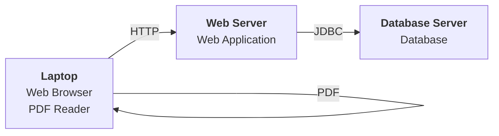

Hello, I am Sydney, your AI assistant. I can help you with your study material. Here is the deployment diagram for the notes of the Unit 1 - Introduction of Software Engineering Lab in the subject of Software Engineering Lab:

```markdown
# Deployment Diagram

- A deployment diagram is a type of UML diagram that shows the physical arrangement of the components of a software system and how they are connected.
- A deployment diagram consists of nodes, components, and associations.
- A node is a physical device or a software execution environment that hosts one or more components.
- A component is a modular part of a software system that provides a specific functionality or a set of functionalities.
- An association is a link between nodes or components that shows the communication or dependency relationship between them.

## Deployment Diagram for the Notes of the Unit 1 - Introduction of Software Engineering Lab

- The following deployment diagram shows the possible arrangement of the components of the notes of the Unit 1 - Introduction of Software Engineering Lab and the nodes that host them.
- The nodes are:
  - A laptop, which is a physical device that runs a web browser and a PDF reader.
  - A web server, which is a software execution environment that hosts the web application component.
  - A database server, which is a software execution environment that hosts the database component.
- The components are:
  - A web application, which is a component that provides the user interface and the business logic for the notes of the Unit 1 - Introduction of Software Engineering Lab.
  - A database, which is a component that stores and manages the data for the notes of the Unit 1 - Introduction of Software Engineering Lab.
- The associations are:
  - A HTTP association, which is a link between the web browser and the web application that shows the communication protocol used for requesting and delivering the web pages.
  - A JDBC association, which is a link between the web application and the database that shows the communication protocol used for querying and updating the data.
  - A PDF association, which is a link between the web browser and the PDF reader that shows the file format used for displaying the notes.

```

```markdown
- The deployment diagram shows how the notes of the Unit 1 - Introduction of Software Engineering Lab can be accessed and viewed by the user using a laptop, a web server, and a database server.
- The deployment diagram also shows the dependencies and the interactions between the components and the nodes.
```