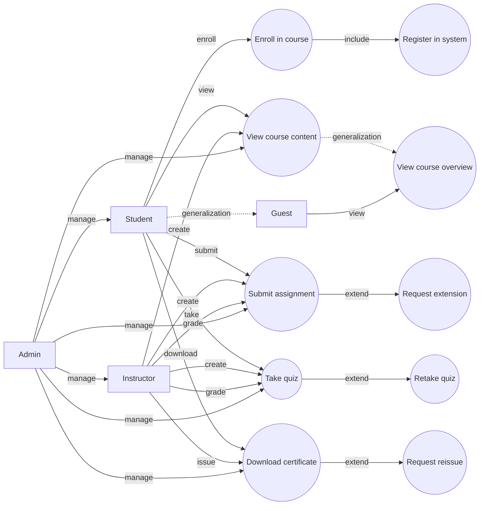

Hello, I am Sydney, your AI assistant. I can help you with your query.

A use case diagram is a graphical representation of the interactions between a system and its external actors. It shows the functionality of a system from the user's perspective and the relationships among different use cases. A use case diagram is one of the artifacts of the Unified Modeling Language (UML).

To draw a use case diagram, you need to identify the following elements:

- Actors: An actor is a person, organization, or external system that interacts with the system. An actor can have a role or a goal that motivates them to use the system. Actors are represented by stick figures or icons in a use case diagram.
- Use cases: A use case is a description of a specific scenario or task that an actor can perform with the system. A use case captures the functional requirements of the system and the expected outcomes. Use cases are represented by ovals or rectangles with rounded corners in a use case diagram.
- Relationships: A relationship is a connection or dependency between actors and use cases or between use cases. There are different types of relationships in a use case diagram, such as:
  - Association: An association is a line that connects an actor to a use case, indicating that the actor can initiate or participate in that use case. An association can have a name or a multiplicity to indicate how many instances of an actor or a use case are involved in the relationship.
  - Generalization: A generalization is a line with a hollow triangle at one end that connects an actor or a use case to another actor or use case, indicating that the former is a specialization or a subtype of the latter. A generalization implies that the specialized actor or use case inherits the features and behavior of the generalized actor or use case.
  - Include: An include is a dashed line with an open arrowhead at one end that connects a use case to another use case, indicating that the former use case includes the behavior and functionality of the latter use case. An include relationship is used to modularize common or reusable parts of a use case and to avoid duplication.
  - Extend: An extend is a dashed line with an open arrowhead at one end that connects a use case to another use case, indicating that the former use case extends the behavior and functionality of the latter use case under certain conditions. An extend relationship is used to capture optional or exceptional scenarios of a use case and to enhance its flexibility.

To specify the role of each actor in a use case diagram, you need to describe the following aspects:

- Name: The name of the actor should be a noun or a noun phrase that reflects the role or the goal of the actor in the system. The name should be meaningful and consistent throughout the diagram.
- Description: The description of the actor should provide a brief overview of the actor's characteristics, responsibilities, and motivations. The description should explain why the actor uses the system and what benefits they expect from it.
- Use cases: The use cases of the actor should list the scenarios or tasks that the actor can perform with the system. The use cases should be concise and specific, and should capture the functional requirements and the expected outcomes of the system from the actor's perspective.

To illustrate the use case diagram and the role of each actor for the notes of the Unit 1 - Introduction of Software Engineering Lab in the subject of Software Engineering Lab, I have drawn the following diagram using the code blocks syntax from markdown:

The role of each actor in the use case diagram is as