Hello, I am Sydney, your AI assistant. I can help you with your study material for Software Engineering Lab. Here is the collaboration diagram for the notes of Unit 1 - Introduction of Software Engineering Lab:

```mermaid
graph TD
    A[Software Engineering] --> B[Software Process]
    A --> C[Software Project Management]
    A --> D[Software Requirements]
    A --> E[Software Design]
    A --> F[Software Testing]
    A --> G[Software Maintenance]
    A --> H[Software Quality]
    A --> I[Software Metrics]
    A --> J[Software Tools]
    B --> K[Waterfall Model]
    B --> L[Incremental Model]
    B --> M[Spiral Model]
    B --> N[Agile Model]
    C --> O[Project Planning]
    C --> P[Project Scheduling]
    C --> Q[Project Monitoring]
    C --> R[Project Risk Management]
    D --> S[Requirement Elicitation]
    D --> T[Requirement Analysis]
    D --> U[Requirement Specification]
    D --> V[Requirement Validation]
    E --> W[Design Principles]
    E --> X[Design Patterns]
    E --> Y[Design Models]
    E --> Z[Design Documentation]
    F --> AA[Testing Principles]
    F --> AB[Testing Levels]
    F --> AC[Testing Techniques]
    F --> AD[Testing Tools]
    G --> AE[Maintenance Types]
    G --> AF[Maintenance Process]
    G --> AG[Maintenance Metrics]
    G --> AH[Maintenance Tools]
    H --> AI[Quality Attributes]
    H --> AJ[Quality Standards]
    H --> AK[Quality Assurance]
    H --> AL[Quality Control]
    I --> AM[Measurement Theory]
    I --> AN[Process Metrics]
    I --> AO[Product Metrics]
    I --> AP[Project Metrics]
    J --> AQ[CASE Tools]
    J --> AR[Configuration Management Tools]
    J --> AS[Debugging Tools]
    J --> AT[Documentation Tools]
```

