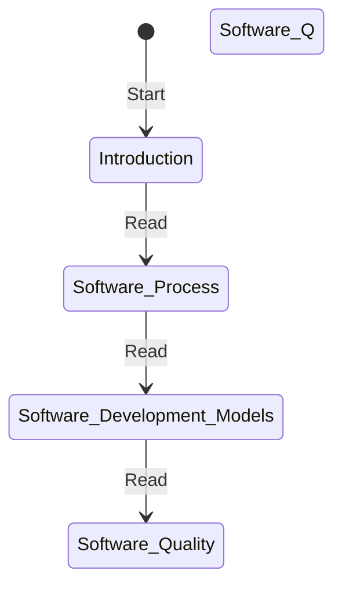

A state chart diagram is a type of behavioral diagram in UML that shows the transitions between various states of an object or a system in response to events. It is also called a state machine diagram or a state transition diagram. A state chart diagram can be used to model the behavior of a class, a subsystem, a package, or even an entire system. A state chart diagram consists of the following elements:

- States: A state is a condition in which an object or a system exists and performs some activity. A state can be simple or composite. A simple state has no substates, while a composite state can be decomposed into nested substates. A state can have an entry action, an exit action, and a do activity. An entry action is performed when the state is entered, an exit action is performed when the state is exited, and a do activity is performed while the state is active.
- Transitions: A transition is a link between two states that represents a change in the state of an object or a system due to an event. A transition can have a trigger, a guard, and an effect. A trigger is an event that causes the transition to occur, a guard is a condition that must be true for the transition to take place, and an effect is an action that is performed as a result of the transition.
- Events: An event is a stimulus that triggers a transition. An event can be internal or external. An internal event is generated by the object or the system itself, while an external event is generated by the environment or another object or system. An event can have parameters that provide additional information about the event.
- Pseudostates: A pseudostate is a graphical symbol that denotes a connection point or a choice point in a state chart diagram. A pseudostate can be one of the following types:
  - Initial: An initial pseudostate represents the default initial state of an object or a system. There can be only one initial pseudostate in a state chart diagram.
  - Final: A final pseudostate represents the final state of an object or a system. A final pseudostate indicates that the object or the system has completed its behavior and is ready to be terminated or deleted. There can be more than one final pseudostate in a state chart diagram.
  - History: A history pseudostate represents the most recent active substate of a composite state. A history pseudostate can be shallow or deep. A shallow history pseudostate remembers only the direct substate of a composite state, while a deep history pseudostate remembers the nested substates of a composite state.
  - Fork: A fork pseudostate represents a point where a transition splits into two or more parallel transitions. A fork pseudostate indicates that the object or the system can be in more than one state at the same time. A fork pseudostate has one incoming transition and two or more outgoing transitions.
  - Join: A join pseudostate represents a point where two or more parallel transitions merge into one transition. A join pseudostate indicates that the object or the system can only proceed to the next state when all the parallel transitions have reached the join point. A join pseudostate has two or more incoming transitions and one outgoing transition.
  - Choice: A choice pseudostate represents a point where a transition branches into two or more alternative transitions based on a guard condition. A choice pseudostate indicates that the object or the system can take different paths depending on the outcome of the guard condition. A choice pseudostate has one incoming transition and two or more outgoing transitions with guards.
  - Junction: A junction pseudostate represents a point where a transition joins with another transition. A junction pseudostate indicates that the object or the system can take different paths depending on the trigger event. A junction pseudostate has one or more incoming transitions and one or more outgoing transitions with triggers.
  - Terminate: A terminate pseudostate represents a point where the object or the system is terminated abruptly. A terminate pseudostate indicates that the object or the system has reached an invalid or erroneous state and cannot continue its behavior. A terminate pseudostate has one incoming transition and no outgoing transition.

The following is an example of a state chart diagram for the notes of the Unit 1 - Introduction of Software Engineering Lab in the subject of Software Engineering Lab:

