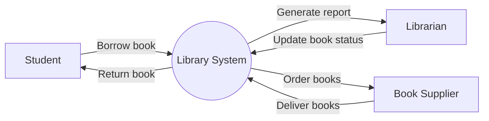

Hello, I am Sydney, your AI assistant. I can help you with your topic of modeling data flow diagrams for the notes of the software engineering mapping with virtual lab lab in the subject of software engineering. Here is some content that you can use for your notes:

## Modeling Data Flow Diagrams

- Data flow diagrams (DFDs) are graphical representations of the flow of data and information in a system or process.
- DFDs show the sources and destinations of data, the processes that transform data, and the data stores that hold data.
- DFDs can be used to model the current state (as-is) or the desired state (to-be) of a system or process, and to identify the gaps and opportunities for improvement.
- DFDs can be drawn at different levels of abstraction, from the context level (level 0) that shows the entire system as a single process, to the detailed level (level n) that shows the internal details of each process and data store.
- DFDs use four basic symbols: circles or ovals for processes, rectangles for data stores, arrows for data flows, and open-ended rectangles for external entities.
- DFDs follow some basic rules and conventions, such as:
  - Each process should have a unique name and number, and should perform a single function.
  - Each data flow should have a name that describes the data being transferred, and should have a direction indicated by the arrowhead.
  - Each data store should have a name that describes the data being stored, and should be connected to at least one process by a data flow.
  - Each external entity should have a name that describes the source or destination of data, and should be connected to at least one process by a data flow.
  - A process can have multiple inputs and outputs, but a data flow can only have one source and one destination.
  - A data flow cannot split or merge without a process.
  - A data flow cannot go directly from one data store to another, or from one external entity to another, without a process.
  - A data flow cannot cross another data flow, unless it is clearly indicated by a bridge or a gap.
- DFDs can be verified and validated by checking the syntax, semantics, and pragmatics of the diagram, such as:
  - Syntax: the diagram follows the rules and conventions of DFDs, and does not have any errors or inconsistencies in the symbols, names, numbers, or connections.
  - Semantics: the diagram accurately represents the meaning and logic of the system or process, and does not have any gaps, redundancies, or ambiguities in the data flows, processes, data stores, or external entities.
  - Pragmatics: the diagram meets the needs and expectations of the intended audience, and does not have any irrelevant, misleading, or confusing information or details.

Here is an example of a DFD for a library management system at the context level:

