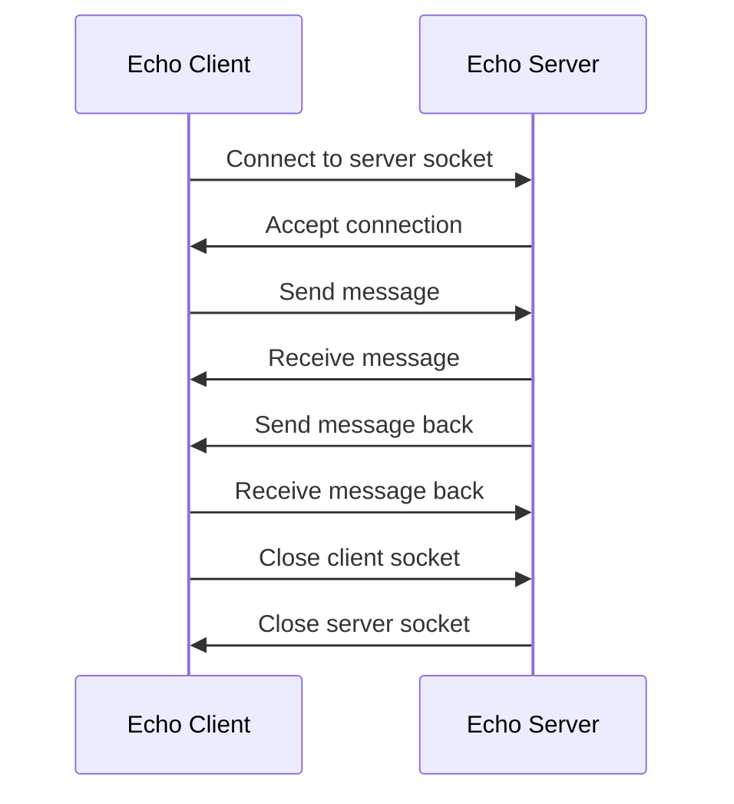

### Experiment 8.1 - Echo client and echo server

- An echo client and an echo server are programs that communicate over a network using the TCP protocol.
- The echo client sends a message to the echo server and waits for a response.
- The echo server receives the message and sends it back to the echo client unchanged.
- The echo client and the echo server can be implemented in different programming languages, such as Java, C, Python, etc.
- The echo client and the echo server can run on the same machine or on different machines connected by a network.
- The echo client and the echo server need to know each other's IP address and port number to establish a connection.
- The echo client and the echo server use sockets to communicate over the network.
- A socket is an endpoint of a communication channel that allows two processes to exchange data.
- A socket is identified by a combination of an IP address and a port number.
- A port number is a 16-bit integer that distinguishes different services on the same machine.
- The echo client and the echo server use the following steps to communicate:

  1. The echo server creates a server socket and binds it to a port number.
  2. The echo server listens for incoming connections on the server socket.
  3. The echo client creates a client socket and connects it to the server socket using the server's IP address and port number.
  4. The echo server accepts the connection and creates a new socket for communication with the client.
  5. The echo client sends a message to the server socket using the client socket.
  6. The echo server receives the message from the client socket using the server socket.
  7. The echo server sends the message back to the client socket using the server socket.
  8. The echo client receives the message from the server socket using the client socket.
  9. The echo client and the echo server close their sockets and terminate the connection.

- The following diagram illustrates the communication between the echo client and the echo server:

