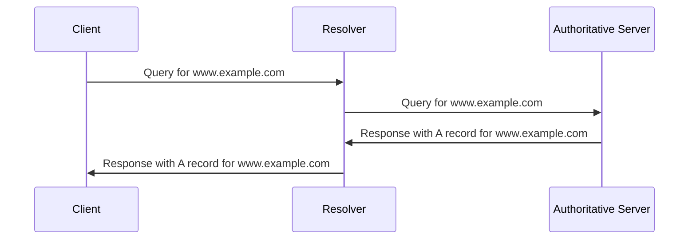

### Experiment 9.1 - DNS

DNS stands for Domain Name System. It is a distributed database that maps domain names to IP addresses and other information. DNS enables users to access websites and other resources using human-readable names instead of numerical addresses.

The main components of DNS are:

- Domain names: hierarchical names that identify a domain or a subdomain on the Internet. For example, `example.com` is a domain name, and `www.example.com` is a subdomain of `example.com`.
- Name servers: servers that store and provide DNS records for a domain or a subdomain. Name servers are organized in a hierarchical structure, with root servers at the top, followed by top-level domain (TLD) servers, authoritative servers, and caching servers.
- DNS records: data entries that associate a domain name with an IP address or other information. DNS records have different types, such as A, AAAA, CNAME, MX, NS, PTR, SOA, SRV, and TXT.
- DNS queries: requests sent by clients to name servers to resolve a domain name to an IP address or other information. DNS queries can be iterative or recursive, depending on how the name servers handle them.
- DNS responses: replies sent by name servers to clients to provide the requested DNS records or an error message. DNS responses can be positive or negative, depending on whether the name server has the requested DNS records or not.

The following diagram illustrates the basic steps of a DNS query and response:

