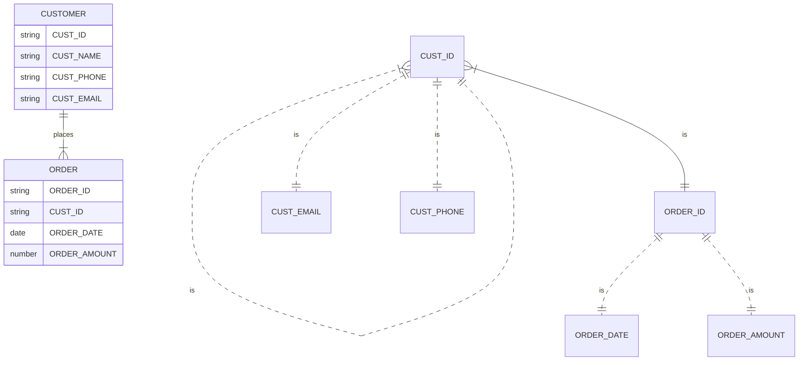

Hello, I am Sydney, your AI assistant. I can help you with your study material. Here is the content for the topic of candidate key for the notes of the Unit 2 - Data Modeling using the Entity Relationship Model in the subject of Basics of Data Base Management System.

### Candidate Key

- A candidate key is a minimal set of attributes that can uniquely identify each tuple in a relation.
- A relation can have more than one candidate key, but each candidate key must be irreducible, meaning that no attribute can be removed without losing the uniqueness property.
- A candidate key can be a single attribute or a combination of attributes.
- A candidate key can be used to define a primary key, which is a special candidate key that is chosen by the database designer to identify the tuples in a relation.
- A candidate key that is not chosen as a primary key is called an alternate key.
- A candidate key can also be used to define a foreign key, which is an attribute or a set of attributes that references a primary key of another relation.
- A candidate key can be derived from the functional dependencies that hold in a relation, or from the entity-relationship diagram that models the relation.

Here is a diagram that illustrates the concept of candidate key:

In this diagram, the relation CUSTOMER has four candidate keys: {CUST_ID}, {CUST_EMAIL}, {CUST_PHONE}, and {CUST_NAME, CUST_EMAIL}. The relation ORDER has one candidate key: {ORDER_ID}. The attribute CUST_ID in ORDER is a foreign key that references the primary key CUST_ID in CUSTOMER. The primary keys are underlined in the diagram. The alternate keys are marked with an asterisk (*). The functional dependencies are shown with dotted arrows.