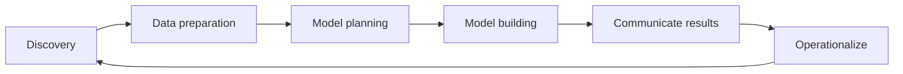

## Unit 2 - Data Analytics Lifecycle

The data analytics lifecycle is a framework for planning and executing data analysis projects. It consists of six phases:

1. **Discovery**: This phase involves identifying the business problem, defining the objectives and scope of the analysis, and gathering the relevant data sources and stakeholders.
2. **Data preparation**: This phase involves cleaning, transforming, and integrating the data into a suitable format for analysis. It also involves exploring the data to understand its characteristics, quality, and distribution.
3. **Model planning**: This phase involves selecting the appropriate analytical techniques and tools to address the business problem, such as regression, classification, clustering, or visualization. It also involves designing and testing the analytical models and validating their assumptions and performance.
4. **Model building**: This phase involves applying the analytical models to the prepared data and generating the outputs, such as predictions, insights, or recommendations. It also involves evaluating the results and refining the models as needed.
5. **Communicate results**: This phase involves presenting and communicating the results of the analysis to the stakeholders, using clear and concise language and visuals. It also involves explaining the methodology, assumptions, limitations, and implications of the analysis.
6. **Operationalize**: This phase involves deploying the analytical models into production, where they can be used to support decision making or automate processes. It also involves monitoring and maintaining the models, and updating them as the data or business needs change.

The following diagram illustrates the data analytics lifecycle:

