# Depicting asynchronous messages with/without priority in UML

- An asynchronous message is a message that is sent without causing the sender to wait for a reply .
- The recipient of an asynchronous message must be an active class, with the asynchronous message being a hardware or software interrupt.
- An asynchronous message is the only message type for which you can individually move the sending and receiving points.
- An asynchronous message has an open arrow head .
- You can create an asynchronous message with or without a behavior execution specification.
- A behavior execution specification is a notation that shows the duration of an action or a state in a lifeline.
- You can use a * to indicate a priority for an asynchronous message.
- A priority means that the message will be processed before any other messages that are received later.
- You can use a dashed line to indicate a lost message.
- A lost message can occur when a message is sent to an element outside the scope of the UML diagram.
- Here is an example of a UML sequence diagram that shows asynchronous messages with and without priority and behavior execution specification:

```plantuml
@startuml
participant A
participant B
participant C
A ->> B : m1
A ->> C : m2
B ->> C : m3
B ->> C : m4 *
C ->> A : m5
C ->> B : m6
C ->> B : m7
B ->> A : m8
B ->> A : m9
A ->> B : m10
A ->> B : m11
B ->> A : m12
B ->> A : m13
A ->> B : m14
A ->> B : m15
B ->> A : m16
B ->> A : m17
A ->> B : m18
A ->> B : m19
B ->> A : m20
B ->> A : m21
A ->> B : m22
A ->> B : m23
B ->> A : m24
B ->> A : m25
A ->> B : m26
A ->> B : m27
B ->> A : m28
B ->> A : m29
A ->> B : m30
A ->> B : m31
B ->> A : m32
B ->> A : m33
A ->> B : m34
A ->> B : m35
B ->> A : m36
B ->> A : m37
A ->> B : m38
A ->> B : m39
B ->> A : m40
B ->> A : m41
A ->> B : m42
A ->> B : m43
B ->> A : m44
B ->> A : m45
A ->> B : m46
A ->> B : m47
B ->> A : m48
B ->> A : m49
A ->> B : m50
A ->> B : m51
B ->> A : m52
B ->> A : m53
A ->> B : m54
A ->> B : m55
B ->> A : m56
B ->> A : m57
A ->> B : m58
A ->> B : m59
B ->> A : m60
B ->> A : m61
A ->> B : m62
A ->> B : m63
B ->> A : m64
B ->> A : m65
A ->> B : m66
A ->> B : m67
B ->> A : m68
B ->> A : m69
A ->> B : m70
A ->> B : m71
B ->> A : m72
B ->> A : m73
A ->> B : m74
A ->> B : m75
B ->> A : m76
B ->> A : m77
A ->> B : m78
A ->> B : m79
B ->> A : m80
B ->> A : m81
A ->> B : m82
A ->> B : m83
B ->> A :

```

