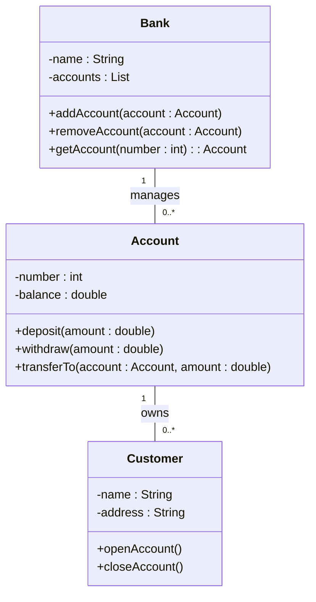

### diagrams for the notes of the Unit 2 - Basic Structural Modeling in the subject of Object Oriented System Design

- Basic structural modeling is the process of describing the static structure of a system using classes, relationships, interfaces, components, and nodes.
- UML (Unified Modeling Language) is a standard graphical language for modeling object-oriented systems using diagrams.
- UML defines two types of diagrams: structural diagrams and behavioral diagrams. Structural diagrams show the static aspects of a system, such as the classes and their attributes, operations, and relationships. Behavioral diagrams show the dynamic aspects of a system, such as the interactions and state changes of the objects.
- UML provides six types of structural diagrams: class diagrams, object diagrams, composite structure diagrams, component diagrams, deployment diagrams, and package diagrams.
- Class diagrams are the most widely used structural diagrams. They show the classes of a system, their attributes, operations, and the relationships among them. Class diagrams can be used to model the entire system, or a specific part of it. Class diagrams can also show interfaces, which are collections of operations that specify a contract for a class. Class diagrams can also show collaborations, which are sets of classes that work together to achieve a common goal.
- Object diagrams are similar to class diagrams, but they show the instances of classes and their values, rather than the classes themselves. Object diagrams can be used to show the state of a system at a specific point in time, or to illustrate an example scenario.
- Composite structure diagrams are a special type of class diagrams that show the internal structure of a class or a component. They show the parts of a class or a component, and how they are connected by ports and connectors. Composite structure diagrams can be used to model complex systems that are composed of smaller subsystems, or to show the implementation details of a class or a component.
- Component diagrams show the components of a system and their dependencies. Components are modular units of a system that provide a well-defined interface and can be replaced or reused. Component diagrams can be used to model the physical or logical architecture of a system, or to show the deployment of components on nodes.
- Deployment diagrams show the nodes of a system and their relationships. Nodes are physical or virtual devices that host components or artifacts. Deployment diagrams can be used to model the hardware or software configuration of a system, or to show the distribution of components or artifacts on nodes.
- Package diagrams show the packages of a system and their dependencies. Packages are groups of elements that share a common namespace and can be organized hierarchically. Package diagrams can be used to model the logical structure of a system, or to show the visibility and accessibility of elements within a package.

The following are some examples of structural diagrams in UML:

- A class diagram that shows the classes of a bank system, their attributes, operations, and relationships:



- An object diagram that shows the state of a bank system at a specific point in time, with two customers and three accounts:

```mermaid
classDiagram
object Alice : Customer {
  name = "Alice"
  address = "123 Main Street"
}
object Bob : Customer {
  name = "Bob"
  address = "456 High Street"
}
object Bank1 : Bank {
  name = "Bank1"
  accounts = [Account1, Account2, Account3]
}
object Account1 : Account {
  number = 1001
  balance = 500.0
}
object Account2 : Account {
  number = 1002
  balance = 1000.0
}
object Account3 : Account {
  number = 1003
  balance = 1500.0
}
Account1 "1" -- "0..*" Alice : owns
Account2 "1" -- "0..*" Bob : owns
Account3 "1" -- "0..*" Alice : owns
Account3 "1" -- "0..*"

```
