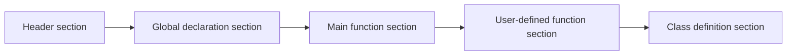

### Program structure

A C++ program consists of various elements, such as keywords, identifiers, constants, variables, operators, expressions, statements, comments, preprocessor directives, functions, classes, and objects. These elements are organized into different sections, such as the header section, the global declaration section, the main function section, the user-defined function section, and the class definition section. The following diagram illustrates the general structure of a C++ program:



The header section contains the `#include` directives that instruct the compiler to include the header files that contain the declarations of standard library functions and classes. For example, `#include <iostream>` includes the header file that defines the input/output stream objects, such as `cin` and `cout`.

The global declaration section contains the declarations of global variables and constants that can be accessed throughout the program. For example, `const double PI = 3.14;` declares a global constant named `PI` with the value of 3.14.

The main function section contains the definition of the `main` function, which is the entry point of the program. The `main` function has the following syntax:

```cpp
int main()
{
    // statements
    return 0;
}
```

The `main` function returns an `int` value, which indicates the status of the program execution. A return value of 0 means the program executed successfully, while a non-zero value means the program encountered an error. The `main` function can also take command-line arguments as parameters, as shown below:

```cpp
int main(int argc, char* argv[])
{
    // statements
    return 0;
}
```

The `argc` parameter represents the number of arguments passed to the program, while the `argv` parameter is an array of pointers to the arguments. The first argument is always the name of the program itself.

The user-defined function section contains the definitions of the functions that are created by the programmer to perform specific tasks. A function has the following syntax:

```cpp
return_type function_name(parameter_list)
{
    // statements
    return value;
}
```

The `return_type` specifies the data type of the value that the function returns. The `function_name` is an identifier that uniquely names the function. The `parameter_list` is a comma-separated list of parameters that the function takes as input. The `value` is the expression that the function returns as output. A function can also have no parameters or no return value, as shown below:

```cpp
void function_name()
{
    // statements
}
```

The class definition section contains the definitions of the classes that are created by the programmer to represent abstract data types. A class has the following syntax:

```cpp
class class_name
{
    // access_specifier:
    // member_variables;
    // member_functions;
};
```

The `class_name` is an identifier that uniquely names the class. The `access_specifier` determines the visibility of the member variables and member functions. The `member_variables` are the data members that store the state of the class. The `member_functions` are the functions that define the behavior of the class. A class can also have constructors, destructors, and operators, as shown below:

```cpp
class class_name
{
    public:
    // constructor
    class_name(parameter_list)
    {
        // statements
    }

    // destructor
    ~class_name()
    {
        // statements
    }

    // operator
    return_type operator operator_symbol(parameter_list)
    {
        // statements
        return value;
    }

    // other member variables and functions
};
```