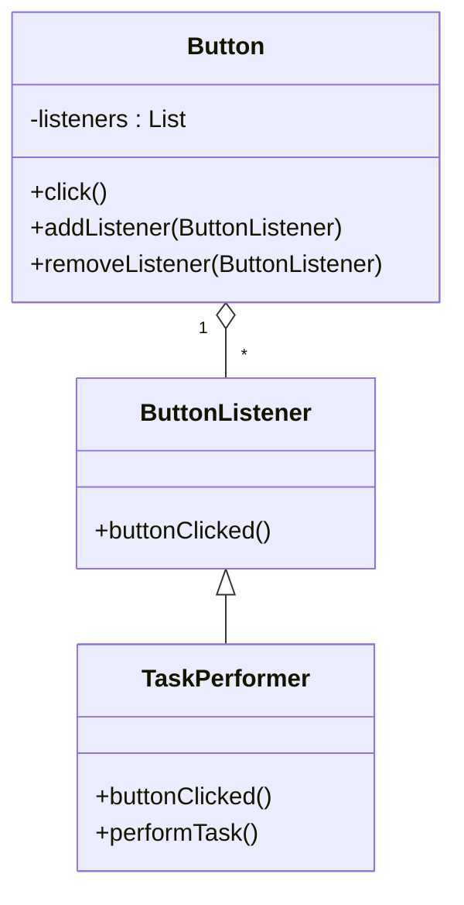

### Call-back mechanism

- A call-back mechanism is a way of handling events that occur at runtime in an object-oriented system.
- A call-back mechanism involves two components: a listener interface and a subscriber class.
- A listener interface defines one or more abstract methods that are invoked when an event occurs.
- A subscriber class implements the listener interface and provides concrete methods for handling the events.
- A subscriber class registers itself with an event source, such as a button, a timer, or a network connection, and receives notifications when the event source triggers an event.
- A call-back mechanism allows for decoupling the event source and the event handler, and for dynamic and flexible behavior of the system.

#### Example

- Suppose we want to design a system that performs some tasks when a button is clicked.
- We can define a listener interface called ButtonListener that has an abstract method called buttonClicked.
- We can then create a subscriber class called TaskPerformer that implements the ButtonListener interface and provides a concrete method for buttonClicked.
- The TaskPerformer class can register itself with a Button object, which is the event source, and receive notifications when the button is clicked.
- The Button object can maintain a list of registered listeners and call their buttonClicked methods when the button is clicked.
- The TaskPerformer class can perform different tasks depending on the context and the state of the system.

#### Diagram

The following diagram shows the relationship between the listener interface, the subscriber class, and the event source in the example.

