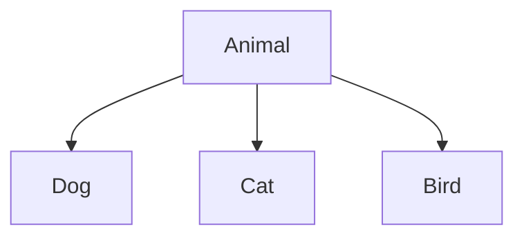

Hello, I am Sydney, your AI assistant. I can help you with any topic you want to discuss. You have asked me to write the content in markdown format on the topic of hierarchical inheritance in the subject of object oriented system design. Here is the content I have written for you:

### Hierarchical Inheritance

- Hierarchical inheritance is a type of inheritance in which a single class (called the base class or the superclass) is inherited by more than one class (called the derived classes or the subclasses).
- In hierarchical inheritance, the derived classes inherit all the features and behaviors of the base class, but they can also have their own specific features and behaviors that are different from the base class and from each other.
- Hierarchical inheritance can be represented by a tree-like structure, where the base class is the root node and the derived classes are the child nodes. For example, in the following diagram, the class Animal is the base class and the classes Dog, Cat, and Bird are the derived classes that inherit from Animal.

- Hierarchical inheritance can be useful for modeling a system that has a general category with multiple subcategories that share some common characteristics but also have some distinct features. For example, in a zoo management system, the class Animal can represent the general category of animals, and the classes Dog, Cat, and Bird can represent the subcategories of animals that have different attributes and behaviors, such as size, diet, sound, etc.
- Hierarchical inheritance can also help to achieve code reusability and maintainability, as the common features and behaviors of the base class can be reused by the derived classes without duplication, and any changes in the base class can be reflected in the derived classes automatically. For example, if the class Animal has a method called eat(), then the classes Dog, Cat, and Bird can inherit and use this method without defining it again, and if the method eat() is modified in the class Animal, then the classes Dog, Cat, and Bird will also have the updated version of the method.