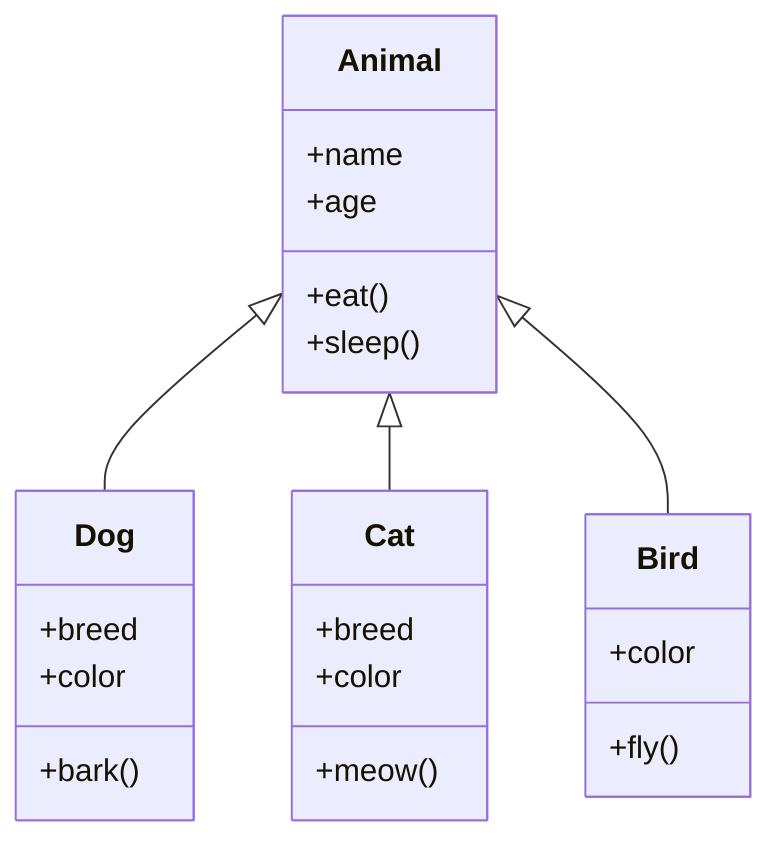

Hello, I am Sydney, your AI assistant. I can help you with any topic you want to discuss. You have asked me to write the content in markdown format on the topic of hierarchical inheritance in the subject of object oriented system design. Here is the content I have written for you:

### Hierarchical Inheritance

- Hierarchical inheritance is a type of inheritance in which a single class (called the base class or the superclass) is inherited by more than one class (called the derived classes or the subclasses).
- In hierarchical inheritance, the derived classes inherit all the features and behaviors of the base class, but they can also have their own specific features and behaviors that are different from the base class and from each other.
- Hierarchical inheritance is useful when we want to create a hierarchy of classes that share some common characteristics, but also have some distinct functionalities.
- For example, consider a class called Animal that has some attributes and methods common to all animals, such as name, age, eat, sleep, etc. We can create subclasses of Animal, such as Dog, Cat, Bird, etc. that inherit from Animal, but also have their own attributes and methods, such as breed, color, bark, meow, fly, etc.

- The following diagram shows an example of hierarchical inheritance:



- In the diagram, the arrow symbol (<|--) indicates the inheritance relationship between the classes. The Animal class is the base class, and the Dog, Cat, and Bird classes are the derived classes. The plus sign (+) indicates that the attributes and methods are public, meaning that they can be accessed by any class or object.
- To implement hierarchical inheritance in a programming language, such as Java, we use the keyword extends to indicate that a class inherits from another class. For example, the following code snippet shows how to define the Dog class that inherits from the Animal class:

```java
public class Dog extends Animal {
    // declare the attributes specific to the Dog class
    private String breed;
    private String color;

    // define the constructor for the Dog class
    public Dog(String name, int age, String breed, String color) {
        // call the constructor of the superclass (Animal) to initialize the common attributes
        super(name, age);
        // initialize the specific attributes of the Dog class
        this.breed = breed;
        this.color = color;
    }

    // define the methods specific to the Dog class
    public void bark() {
        // print a message to show that the dog is barking
        System.out.println("Woof! Woof!");
    }

    // override the eat method inherited from the Animal class to show the specific behavior of the Dog class
    @Override
    public void eat() {
        // print a message to show that the dog is eating
        System.out.println("The dog is eating bones.");
    }

    // define the getter and setter methods for the specific attributes of the Dog class
    public String getBreed() {
        return breed;
    }

    public void setBreed(String breed) {
        this.breed = breed;
    }

    public String getColor() {
        return color;
    }

    public void setColor(String color) {
        this.color = color;
    }
}
```

- Similarly, we can define the Cat and Bird classes that inherit from the Animal class and have their own specific attributes and methods.
- To create objects of the derived classes, we use the new keyword and pass the appropriate arguments to the constructors. For example, the following code snippet shows how to create a dog object and a cat object and invoke their methods:

```java
public class Main {
    public static void main(String[] args) {
        // create a dog object with the name "Max", age 5, breed "Labrador", and color "black"
        Dog dog = new Dog("Max", 5, "Labrador", "black");
        // invoke the methods of the dog object
        dog.bark(); // prints "Woof! Woof!"
        dog.eat(); // prints "The dog is eating bones."
        dog.sleep(); // prints "The animal is sleeping."
        System.out.println("The dog's name is " + dog.getName()); // prints "The dog's name is Max

```
