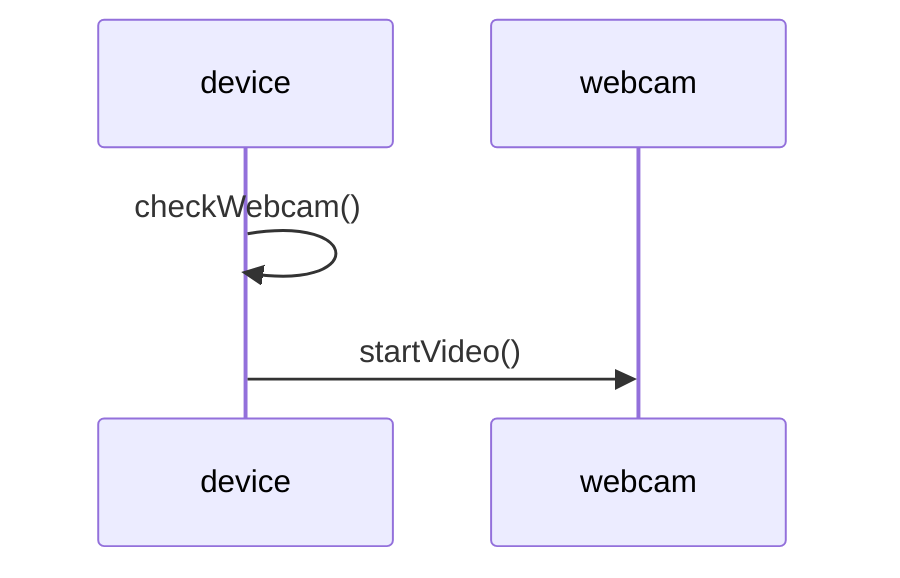

# Use of self in messages

- In object-oriented system design, a message is a request from one object to another object to perform some action or return some information.
- A message consists of a sender, a receiver, a selector, and optional arguments.
- A self message is a special kind of message where the sender and the receiver are the same object.
- A self message is used when an object needs to invoke its own methods or access its own attributes.
- A self message is represented by a U-shaped arrow in a sequence diagram .

## Example of self message

- Consider a scenario where a device object wants to access its webcam object.
- The device object sends a self message to itself to check if the webcam is available.
- The device object then sends a message to the webcam object to start the video stream.
- The sequence diagram for this scenario is shown below:

: https://www.geeksforgeeks.org/unified-modeling-language-uml-sequence-diagrams/
: https://bing.com/search?q=use+of+self+in+messages+object+oriented+system+design
: https://stackoverflow.com/questions/34765555/what-is-message-passing-in-oop
: https://www.developer.com/design/object-responsibility/
: http://csis.pace.edu/~scharff/cs389/ref/ch12cs389.pdf