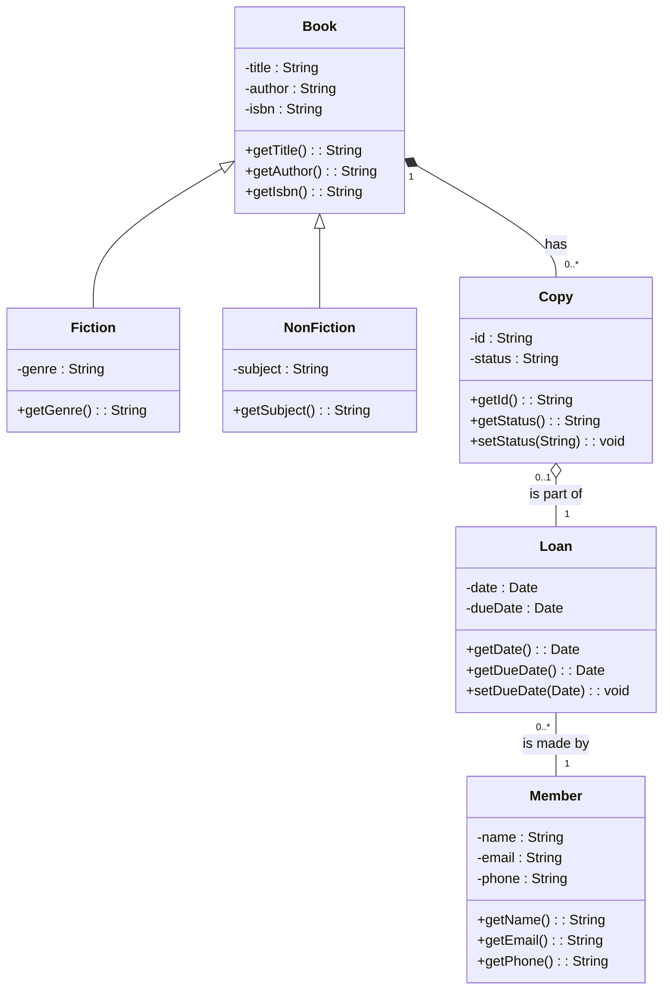

## Unit 2 - Basic Structural Modeling

This unit covers the following topics:

- What is structural modeling and why is it important?
- What are the basic elements of structural modeling, such as classes, attributes, operations, associations, and generalizations?
- How to create and interpret class diagrams using the Unified Modeling Language (UML) notation?
- How to apply structural modeling principles and techniques to design and document software systems?

### What is structural modeling and why is it important?

- Structural modeling is a way of representing the static structure of a software system, such as the types of objects, their properties, and their relationships.
- Structural modeling helps to understand the problem domain, identify the main concepts and entities, and define the interfaces and contracts between them.
- Structural modeling also facilitates communication, documentation, reuse, and maintenance of software systems.

### What are the basic elements of structural modeling, such as classes, attributes, operations, associations, and generalizations?

- A class is a template or blueprint for creating objects of the same kind. It defines the common characteristics and behaviors of a set of objects.
- An attribute is a property or feature of a class or an object. It describes the state or data of an object.
- An operation is a function or method of a class or an object. It defines the behavior or action of an object.
- An association is a relationship between two or more classes or objects. It describes how objects are linked or connected to each other.
- A generalization is a relationship between a more general class (superclass) and a more specific class (subclass). It describes how a subclass inherits the characteristics and behaviors of a superclass.

### How to create and interpret class diagrams using the Unified Modeling Language (UML) notation?

- A class diagram is a graphical representation of the structural model of a software system. It shows the classes, their attributes and operations, and their associations and generalizations.
- The UML notation for a class diagram consists of the following symbols:

  - A rectangle with the name of the class, optionally followed by the attributes and operations of the class, separated by horizontal lines.
  - A solid line with an optional name and multiplicity to indicate an association between two classes.
  - A hollow triangle pointing to the superclass to indicate a generalization between two classes.
  - A dashed line with an open arrowhead to indicate a dependency between two classes.

- For example, the following class diagram shows the structural model of a simple library system:

### How to apply structural modeling principles and techniques to design and document software systems?

- To apply structural modeling principles and techniques to design and document software systems, the following steps are recommended:

  - Identify the main classes and objects of the system, based on the requirements and the problem domain.
  - Define the attributes and operations of each class and object, based on their responsibilities and collaborations.
  - Establish the associations and generalizations between the classes and objects, based on their relationships and inheritance.
  - Draw the class diagram using the UML notation, following the conventions and guidelines for clarity and consistency.
  - Validate and refine the class diagram, checking for completeness, correctness, and coherence.