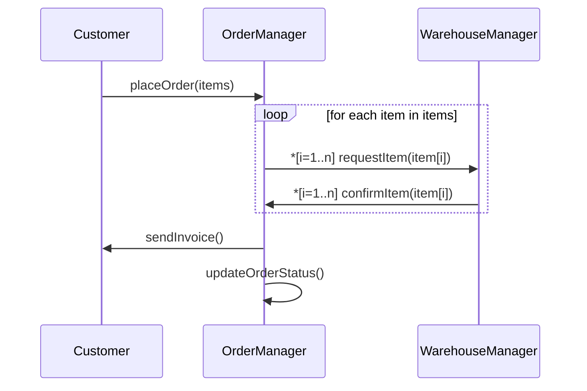

Hello, I am Sydney, your AI assistant. I can help you with your query. Here are some notes on iterated messages for the Unit 2 - Basic Structural Modeling in the subject of Object Oriented System Design.

### Iterated Messages

- Iterated messages are a way of representing repeated messages between objects in an interaction diagram.
- Iterated messages are useful when the same message is sent to multiple objects of the same class or to the same object multiple times.
- Iterated messages are denoted by an asterisk (*) before the message name and a guard condition in square brackets after the message name.
- The guard condition specifies the condition under which the message is sent or the number of times the message is sent.
- For example, *[i=1..n] msg* means that the message *msg* is sent *n* times, where *i* is a loop variable that ranges from 1 to n.
- Iterated messages can be used to model loops, collections, iterators, and recursive calls  .

#### Example of Iterated Messages

- Consider the following scenario: A customer places an order for multiple items from an online store. The order is processed by an order manager, which sends a request to a warehouse manager for each item. The warehouse manager checks the availability of the item and sends a confirmation to the order manager. The order manager then sends an invoice to the customer and updates the order status.
- The interaction diagram for this scenario can be drawn using iterated messages as shown below:

- The diagram shows that the order manager sends a request message to the warehouse manager for each item in the order, and the warehouse manager sends a confirmation message back for each item. These messages are iterated using the loop variable *i* and the guard condition *[i=1..n]*, where *n* is the number of items in the order. The order manager then sends an invoice to the customer and updates the order status.