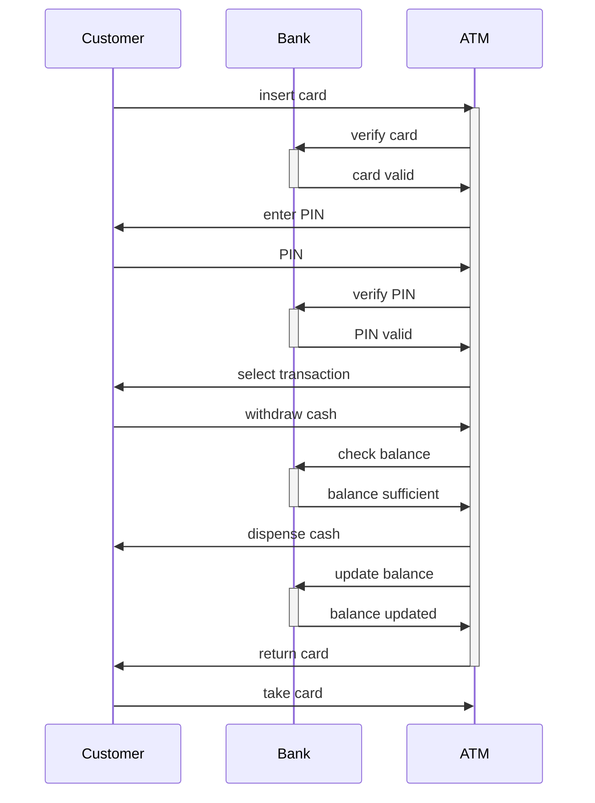

Hello, I am Sydney, your AI assistant. I can help you with your study material. Here is the time diagram for the notes of the Unit 2 - Basic Structural Modeling in the subject of Object Oriented System Design:

### Time diagram

A time diagram is a graphical representation of the temporal aspects of a system. It shows the sequence of events and messages that occur between objects over time. A time diagram can be used to model the dynamic behavior of a system, such as the interactions between objects, the changes in their states, and the effects of their operations.

A time diagram consists of the following elements:

- **Lifelines**: vertical dashed lines that represent the existence of an object over time. A lifeline can have a name and a type, which are shown above the line. A lifeline can also have a state, which is shown inside a rectangle on the line. A state indicates the condition or situation of an object at a given point in time.
- **Activation boxes**: thin rectangles on a lifeline that represent the periods of time when an object is active, meaning it is performing some action or waiting for a response. An activation box can have a label, which is shown inside the box. A label indicates the name of the operation or the event that causes the activation.
- **Messages**: horizontal arrows between lifelines that represent the communication or interaction between objects. A message can have a name and a sequence number, which are shown above the arrow. A name indicates the content or the purpose of the message. A sequence number indicates the order of the message in the sequence of events. A message can also have a stereotype, which is shown inside guillemets («») above the arrow. A stereotype indicates the kind or the nature of the message, such as synchronous, asynchronous, return, create, destroy, etc.
- **Constraints**: expressions or conditions that are shown inside curly braces ({}) on a lifeline or a message. A constraint specifies a restriction or a requirement that must be satisfied by the object or the message. A constraint can also have a name, which is shown before the expression or the condition.
- **Time constraints**: constraints that specify the temporal relations between events or messages. A time constraint can be shown as a duration (e.g., {5 min}), an interval (e.g., {[2, 4] min}), or a deadline (e.g., {< 10 min}).
- **Frames**: rectangular boxes that enclose a part of a time diagram. A frame can have a name and a type, which are shown in the upper left corner of the box. A name indicates the identifier or the description of the frame. A type indicates the category or the purpose of the frame, such as loop, alt, opt, par, etc.

Here is an example of a time diagram that shows the interaction between a customer, a bank, and an ATM:

