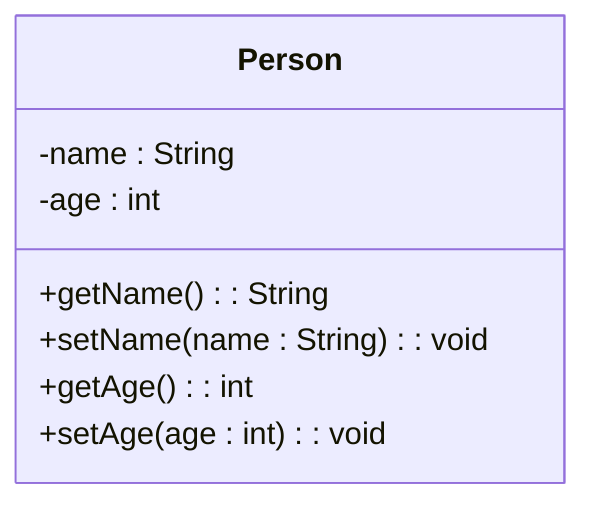

### Private and public members

- In object-oriented system design, classes are the basic units of abstraction that encapsulate data and behavior.
- Classes have members, which are either attributes (data) or operations (behavior).
- Members can have different levels of visibility, which determine how they can be accessed from other classes or objects.
- Public members are visible from anywhere in the system. They can be accessed by any class or object that has a reference to the class or object that defines them.
- Private members are visible only from within the class that defines them. They cannot be accessed by any other class or object, even if they have a reference to the class or object that defines them.
- Public and private members are indicated by the symbols `+` and `-` respectively in UML class diagrams  .
- For example, consider the following class diagram of a `Person` class:

- In this diagram, the `name` and `age` attributes are private, while the `getName`, `setName`, `getAge` and `setAge` operations are public.
- This means that only the `Person` class can access and modify the `name` and `age` attributes directly, while other classes or objects can access and modify them indirectly through the public operations.
- This is an example of data hiding, which is one of the important features of object-oriented programming that allows preventing the functions of a program to access directly the internal representation of a class type.
- Public and private members are the most common levels of visibility, but there are also other levels, such as protected and package, which are used in some object-oriented languages and notations.