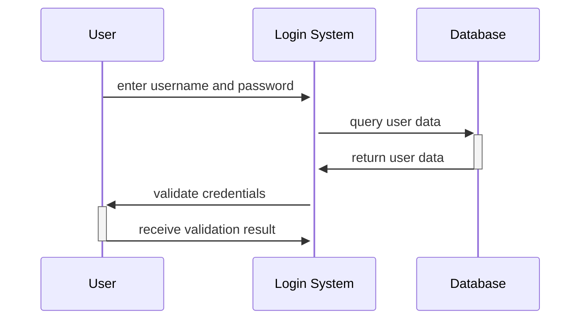

### Interaction Diagram for the Notes of the Unit 2 - Basic Structural Modeling in the Subject of Object Oriented System Design

- An interaction diagram is a type of diagram that shows how different objects or components interact with each other in a system.   
- Interaction diagrams can be used to model the dynamic behavior of a system, the sequence of messages exchanged between the elements, and the structural organization of the objects.   
- There are two types of interaction diagrams: sequence diagrams and collaboration diagrams.   
- A sequence diagram shows the order of messages passing from one element to another in a time-ordered manner.   
- A collaboration diagram shows the relationships among the objects that participate in the interaction.   
- Both sequence and collaboration diagrams can represent the same information, but with different emphases. Sequence diagrams focus on the time sequence of messages, while collaboration diagrams focus on the structural organization of the objects.   
- An interaction diagram can be used to visualize the interactive behavior of a system, the ordered sequences within a system, and the real-time data via UML.  
- An interaction diagram can be drawn using the following elements:     
  - Objects or components: These are the entities that interact with each other in the system. They can be represented by rectangles with the name of the object or component inside.
  - Lifelines: These are vertical dashed lines that indicate the existence of an object or component over time. They can be attached to the bottom of the object or component rectangle.
  - Messages: These are horizontal arrows that show the communication or interaction between the objects or components. They can have labels that indicate the name of the message, the parameters, and the return value.
  - Activation boxes: These are thin rectangles that show the period of time when an object or component is active or executing a message. They can be placed on the lifelines above the messages.
  - Return messages: These are dashed horizontal arrows that show the return of a value or an object from a message. They can have labels that indicate the name of the value or object returned.
  - Combined fragments: These are rectangular frames that enclose a part of the interaction diagram to show conditional or iterative behavior. They can have labels that indicate the type of fragment, such as alt, opt, loop, etc.
  - Interaction occurrences: These are references to other interaction diagrams that are used to simplify complex interactions. They can be represented by pentagons with the name of the referenced diagram inside.

- An example of a sequence diagram for a login system is shown below: 



- An example of a collaboration diagram for the same login system is shown below: 

```mermaid
graph LR
User((User))
Login System((Login System))
Database((Database))
User -- enter username and password --> Login System
Login System -- query user data --> Database
Database -- return user data --> Login System
Login System -- validate credentials --> User
User -- receive validation result --> Login System
```

- The basic structural modeling unit of the subject of object oriented system design covers the following topics: 
  - Classes, interfaces, and collaborations: These are the building blocks of the object-oriented system. They define the properties and behaviors of the objects in the system.
  - Components: These are the modular units of the system that encapsulate the implementation of the classes, interfaces, and collaborations. They can be reused and replaced in different contexts.
  - Objects: These are the instances of the classes, interfaces, and collaborations that exist at runtime. They have state and identity and can communicate with each other via messages.
  - Nodes: These are the physical elements of the system that provide the computational and storage resources for the components and objects. They can be hardware devices, software platforms, or networks