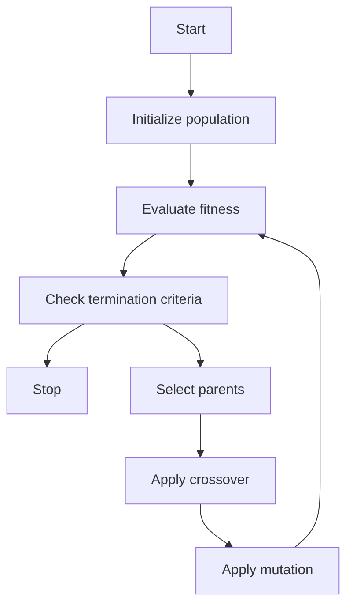

### Flow chart of GA

A genetic algorithm (GA) is a search-based optimization technique based on the principles of genetics and natural selection. It is frequently used to find optimal or near-optimal solutions to difficult problems which otherwise would take a lifetime to solve.

The flow chart of GA is shown below:

The main steps involved in the flow chart of GA are:

- **Initialize population**: Generate a set of random solutions (called chromosomes or individuals) that represent possible answers to the problem. The size of the population is usually fixed and depends on the problem domain and the computational resources available.
- **Evaluate fitness**: Assign a numerical value (called fitness or objective function) to each solution that indicates how well it solves the problem. The higher the fitness, the better the solution. The fitness function is problem-specific and must be defined by the user.
- **Check termination criteria**: Decide whether to stop the algorithm or continue to the next generation. The termination criteria can be based on the number of generations, the fitness of the best solution, the diversity of the population, or any other condition that the user specifies.
- **Select parents**: Choose a subset of solutions (called parents or mates) from the current population that will produce offspring for the next generation. The selection process is usually biased towards the fitter solutions, so that they have a higher chance of being selected. There are different methods of selection, such as roulette wheel, tournament, rank-based, etc.
- **Apply crossover**: Combine two or more parents to generate new solutions (called offspring or children) that inherit some features from each parent. The crossover process is also problem-specific and must be defined by the user. There are different types of crossover, such as one-point, two-point, uniform, etc.
- **Apply mutation**: Modify some features of the offspring randomly to introduce some diversity and exploration in the population. The mutation process is also problem-specific and must be defined by the user. There are different types of mutation, such as bit-flip, swap, insert, etc.
- **Repeat**: Go back to the evaluate fitness step and repeat the process until the termination criteria are met. The best solution found so far is returned as the output of the algorithm.