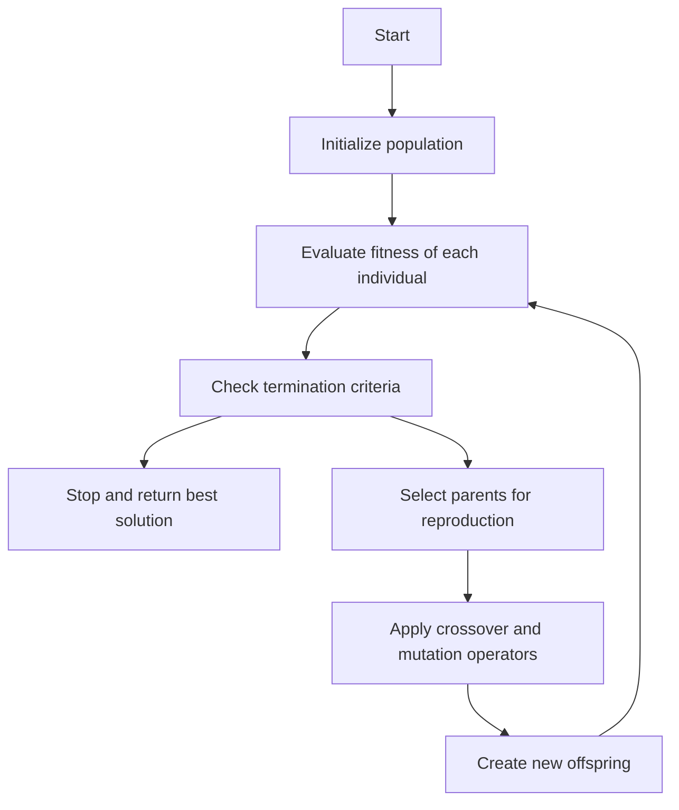

A flow chart of GA is a graphical representation of the steps involved in a genetic algorithm, which is a search-based optimization technique based on the principles of genetics and natural selection. A flow chart of GA can help to understand the main components and operations of the algorithm, as well as to visualize the flow of information and control. A possible flow chart of GA for the notes of the Unit 5 - Genetic Algorithm(GA) in the subject of Application of Soft Computing is shown below:

### Flow chart of GA

The flow chart of GA consists of the following steps:

- Start: The algorithm begins with a problem definition and a set of parameters, such as the population size, the crossover and mutation rates, the fitness function, and the termination criteria.
- Initialize population: The algorithm randomly generates an initial population of individuals, each representing a possible solution to the problem. Each individual is encoded as a string of genes, which can be binary, real-valued, or symbolic.
- Evaluate fitness of each individual: The algorithm evaluates the quality of each individual according to the fitness function, which measures how well the individual solves the problem. The fitness function can be domain-specific or general-purpose, depending on the problem.
- Check termination criteria: The algorithm checks if one or more of the termination criteria are met, such as reaching a maximum number of generations, achieving a desired fitness level, or finding an optimal or near-optimal solution. If any of the criteria are met, the algorithm stops and returns the best solution found so far. Otherwise, the algorithm proceeds to the next step.
- Select parents for reproduction: The algorithm selects a subset of individuals from the current population to produce the next generation. The selection process is based on the fitness of the individuals, such that the fitter individuals have a higher chance of being selected. The selection methods can be proportional, ranking, tournament, or elitist, among others.
- Apply crossover and mutation operators: The algorithm applies two genetic operators to the selected parents: crossover and mutation. Crossover is the process of exchanging genes between two parents to create new offspring. Mutation is the process of randomly altering one or more genes in an individual to introduce diversity. The crossover and mutation rates determine how frequently these operators are applied.
- Create new offspring: The algorithm creates a new population of offspring by applying the crossover and mutation operators to the selected parents. The new population replaces the old one, and the algorithm returns to the step of evaluating the fitness of each individual.