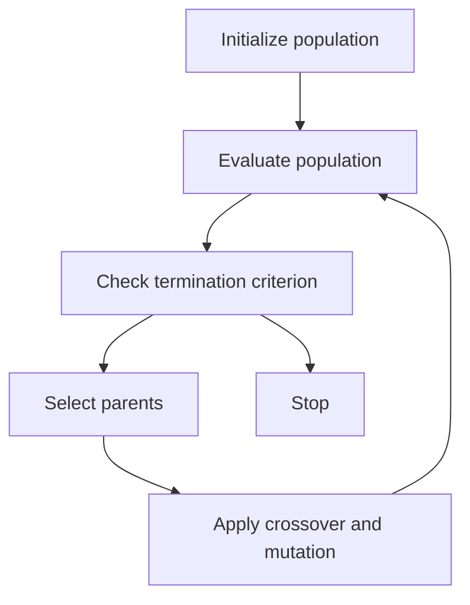

### Generational Cycle for Genetic Algorithm

- A genetic algorithm (GA) is a bio-inspired optimization technique that mimics the natural process of evolution and selection .
- A GA works on a population of candidate solutions, each encoded as a string of symbols (usually binary digits) that represent the values of the problem variables .
- A GA iterates through a series of generations, where each generation consists of the following steps   :

  - **Selection**: A subset of the population is chosen based on their fitness values, which measure how well they solve the problem. The selection process favors the fitter individuals, which have a higher chance of being selected for reproduction  .
  - **Crossover**: Pairs of selected individuals are recombined to produce new offspring, which inherit some features from each parent. Crossover is a way of exploring the search space and creating diversity in the population  .
  - **Mutation**: Some of the offspring are randomly modified by flipping, inserting, deleting, or swapping some of their symbols. Mutation is a way of introducing variation and preventing premature convergence to a suboptimal solution  .
  - **Evaluation**: The fitness values of the offspring are calculated based on the problem objective function. The fitness values are used to rank the individuals and determine their survival chances in the next generation  .
  - **Replacement**: The population is updated by replacing some or all of the old individuals with the new offspring. The replacement strategy can be either generational, where the entire population is replaced, or steady-state, where only a fraction of the population is replaced  .

- The generational cycle is repeated until a termination criterion is met, such as reaching a maximum number of generations, finding an optimal or near-optimal solution, or reaching a convergence threshold  .
- A GA can be represented by a flow chart as shown below:

