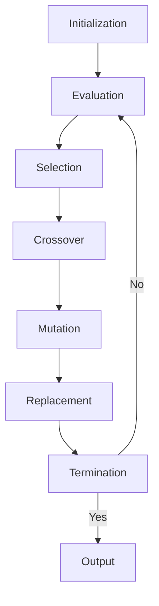

### Generational Cycle for Genetic Algorithm

A genetic algorithm (GA) is a bio-inspired optimization technique that mimics the natural process of evolution. A GA works on a population of candidate solutions, each encoded as a string of symbols (usually binary digits). A GA iteratively applies genetic operators, such as selection, crossover, and mutation, to create new solutions that are hopefully better than the previous ones. A GA evaluates the fitness of each solution according to a predefined objective function, and terminates when a certain criterion is met (such as reaching a maximum number of generations, or finding a solution that satisfies a minimum fitness threshold).

The generational cycle of a GA consists of the following steps:

1. **Initialization**: Generate an initial population of random solutions, usually of a fixed size.
2. **Evaluation**: Calculate the fitness of each solution in the population using the objective function.
3. **Selection**: Choose a subset of solutions from the current population to be the parents of the next generation. The selection process is usually biased towards fitter solutions, meaning that they have a higher probability of being selected. There are different methods of selection, such as roulette wheel, tournament, rank-based, etc.
4. **Crossover**: Apply a recombination operator to pairs of selected parents to produce offspring solutions. The crossover operator exchanges parts of the parent solutions to create new combinations. There are different types of crossover operators, such as one-point, two-point, uniform, etc.
5. **Mutation**: Apply a random modification operator to some of the offspring solutions to introduce diversity and prevent premature convergence. The mutation operator flips, swaps, or inserts symbols in the solution string. The mutation rate is usually low, meaning that only a small fraction of the offspring undergo mutation.
6. **Replacement**: Replace the current population with the new population of offspring solutions. There are different methods of replacement, such as generational (where the entire population is replaced), elitist (where the best solutions are preserved), steady-state (where only a few solutions are replaced), etc.
7. **Termination**: Check if the termination criterion is met. If not, go back to step 2 and repeat the cycle. If yes, return the best solution found so far as the output of the GA.

The following diagram illustrates the generational cycle of a GA:

