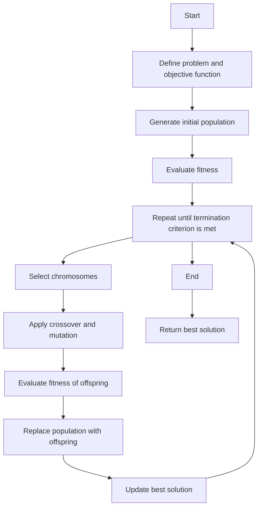

### Flow chart of GA

A flow chart is a graphical representation of the steps involved in a process or an algorithm. A flow chart of GA shows the main components and operations of a genetic algorithm, which is a search-based optimization technique based on the principles of genetics and natural selection.

The following is a possible flow chart of GA for the notes of the Unit 5 - Genetic Algorithm(GA) in the subject of Application of Soft Computing:

- Start
- Define the problem and the objective function to be optimized
- Generate an initial population of candidate solutions (chromosomes) randomly or by using some heuristics
- Evaluate the fitness of each chromosome in the population
- Repeat until a termination criterion is met (such as reaching a maximum number of generations, achieving a desired fitness level, or finding an optimal solution):
  - Select a subset of chromosomes from the current population based on their fitness (selection)
  - Apply genetic operators such as crossover and mutation to the selected chromosomes to create new offspring (variation)
  - Evaluate the fitness of the offspring
  - Replace some or all of the current population with the offspring (replacement)
  - Update the best solution found so far
- End
- Return the best solution found

The following is a possible diagram of the flow chart of GA:

