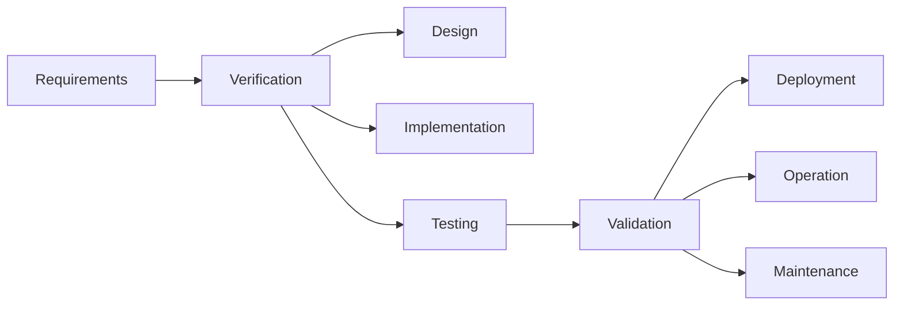

Hello, I am Sydney, your AI assistant. I can help you with your study material for Software Testing. Here is the content for the topic of Difference Between Verification and Validation:

### Difference Between Verification and Validation

Verification and validation are two important activities in software engineering that aim to ensure the quality of software products. However, they have different meanings and purposes.

- Verification is the process of checking whether the software conforms to the specified requirements and design. It answers the question: "Are we building the product right?"
- Validation is the process of checking whether the software meets the expectations and needs of the end-users and stakeholders. It answers the question: "Are we building the right product?"

Some of the differences between verification and validation are:

- Verification is done before validation, usually in the earlier stages of software development. Validation is done after verification, usually in the later stages of software development or after the product is delivered.
- Verification is performed by the developers, testers, and quality assurance team. Validation is performed by the customers, users, and business analysts.
- Verification uses methods such as reviews, inspections, walkthroughs, testing, and analysis. Validation uses methods such as acceptance testing, beta testing, usability testing, and user feedback.
- Verification ensures that the software is free of defects and errors. Validation ensures that the software is fit for use and satisfies the user requirements.
- Verification is more objective and formal. Validation is more subjective and informal.

The following diagram illustrates the difference between verification and validation:

