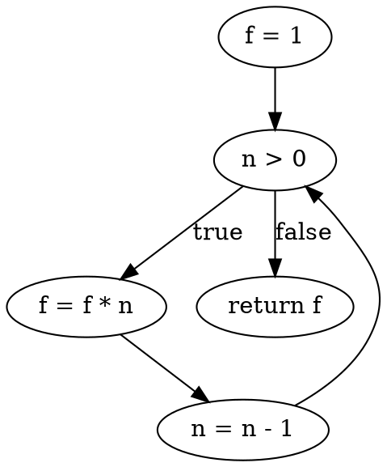

### Generation of Graph from Program

- A graph is a mathematical structure that represents the relationships between a set of objects, called nodes or vertices, and a set of links, called edges or arcs, that connect them.
- A graph can be used to model the control flow of a program, which is the sequence of execution of statements and branches based on conditions and loops.
- A control flow graph (CFG) is a type of graph that shows the possible paths of execution of a program, where each node represents a basic block of code (a sequence of statements with no branches) and each edge represents a transfer of control between basic blocks.
- A CFG can be derived from the source code of a program by identifying the entry and exit points, the basic blocks, and the control flow edges between them.
- A CFG can be used for various purposes in software testing, such as measuring the complexity of a program, designing test cases, and analyzing the coverage of test cases.
- A CFG can be represented in different ways, such as using a graphical notation, an adjacency matrix, or a listing of nodes and edges.
- A graphical notation is a visual representation of a CFG, where each node is drawn as a rectangle or a circle, and each edge is drawn as a line or an arrow, with optional labels for conditions or loop iterations.
- An adjacency matrix is a tabular representation of a CFG, where each row and column corresponds to a node, and each cell contains a value indicating the presence or absence of an edge between the corresponding nodes.
- A listing is a textual representation of a CFG, where each node is assigned a unique identifier, and each edge is specified by the identifiers of the source and destination nodes, with optional labels for conditions or loop iterations.
- An example of a program and its CFG in different representations is shown below:

```c
// Program to compute the factorial of a positive integer n
int factorial(int n) {
  int f = 1; // Node 1
  while (n > 0) { // Node 2
    f = f * n; // Node 3
    n = n - 1; // Node 4
  }
  return f; // Node 5
}
```



```text
// Adjacency matrix of the CFG
  1 2 3 4 5
1 0 1 0 0 0
2 0 0 1 0 1
3 0 0 0 1 0
4 0 1 0 0 0
5 0 0 0 0 0
```

```text
// Listing of the CFG
Nodes: 1, 2, 3, 4, 5
Edges: 1 -> 2, 2 -> 3 (true), 2 -> 5 (false), 3 -> 4, 4 -> 2
```