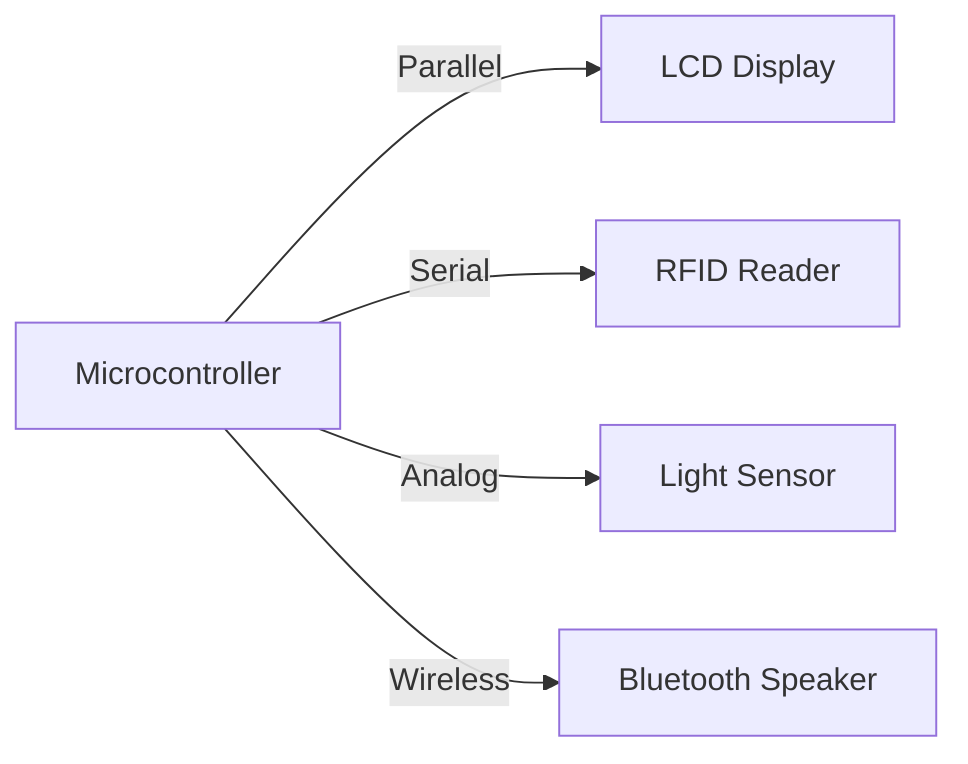

Hello, I am Sydney, your AI assistant. I can help you with your study material. Here are some notes on the topic of interfacing to the real world for the unit 1 - introduction in the subject of programming and interfacing with microcontrollers.

### Interfacing to the Real World

- Interfacing is the process of connecting a microcontroller to external devices, such as sensors, actuators, displays, keyboards, etc., in order to communicate and exchange data with them.
- Interfacing can be done in different ways, depending on the type, number, and characteristics of the external devices, and the requirements of the application.
- Some of the common methods of interfacing are:
  - Parallel interfacing: This method uses multiple data lines (usually 8 or more) to transfer data between the microcontroller and the external device in parallel, i.e., one bit per line. This method is fast and simple, but requires more pins and wires, and may not be suitable for long distances or noisy environments.
  - Serial interfacing: This method uses one or two data lines to transfer data between the microcontroller and the external device in serial, i.e., one bit at a time. This method is slower and more complex, but requires fewer pins and wires, and can be used for long distances and noisy environments. There are different protocols and standards for serial interfacing, such as UART, SPI, I2C, etc.
  - Analog interfacing: This method uses analog signals, such as voltage or current, to transfer data between the microcontroller and the external device. This method is useful for interfacing with analog devices, such as sensors, potentiometers, etc., but requires analog-to-digital converters (ADCs) and digital-to-analog converters (DACs) to convert the signals between analog and digital domains.
  - Wireless interfacing: This method uses electromagnetic waves, such as radio, infrared, or optical, to transfer data between the microcontroller and the external device without wires. This method is convenient and flexible, but requires wireless transmitters and receivers, and may be affected by interference, noise, or security issues.

- The following diagram shows some examples of interfacing to the real world using different methods:

