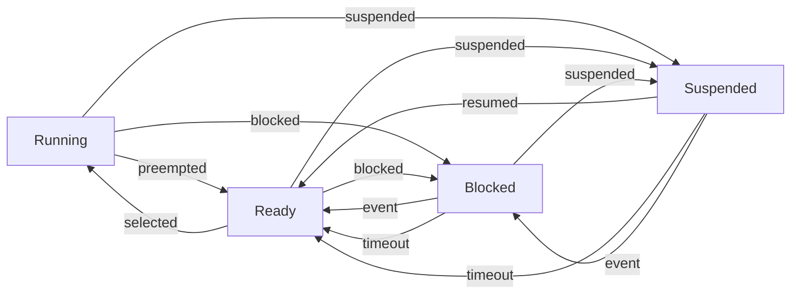

### Task States

A task is a unit of execution in a real-time kernel. A task can have different states depending on its current status and priority. The following are some common task states in real-time kernels   :

- **Running**: The task is executing on the CPU. This is the only possible state for a task in user space. In kernel space, a task can also be running if it is actively performing some operation. Only one task can be in this state at any time after kernel initialization.
- **Ready**: The task is ready to be executed, but it is not currently running. It is either waiting for its turn to run on the CPU, or it has been preempted by a higher priority task. A task can become ready from running, blocked, or suspended states. A ready task is placed on a run queue according to its priority and scheduling policy.
- **Blocked**: The task is waiting for an event, such as I/O, semaphore, message, timer, or interrupt, to occur. A task can become blocked from running or ready states. A blocked task is removed from the run queue and placed on a wait queue until the event occurs. A blocked task can also have a timeout value, which specifies how long it will wait for the event before becoming ready again.
- **Suspended**: The task is not eligible to run, because it has been explicitly suspended by another task or by itself. A task can become suspended from running, ready, or blocked states. A suspended task is removed from the run queue and the wait queue, and it will not resume until it is explicitly resumed by another task or by itself. A suspended task can also have a timeout value, which specifies how long it will remain suspended before becoming ready again.

The following diagram shows the possible transitions between the task states:

