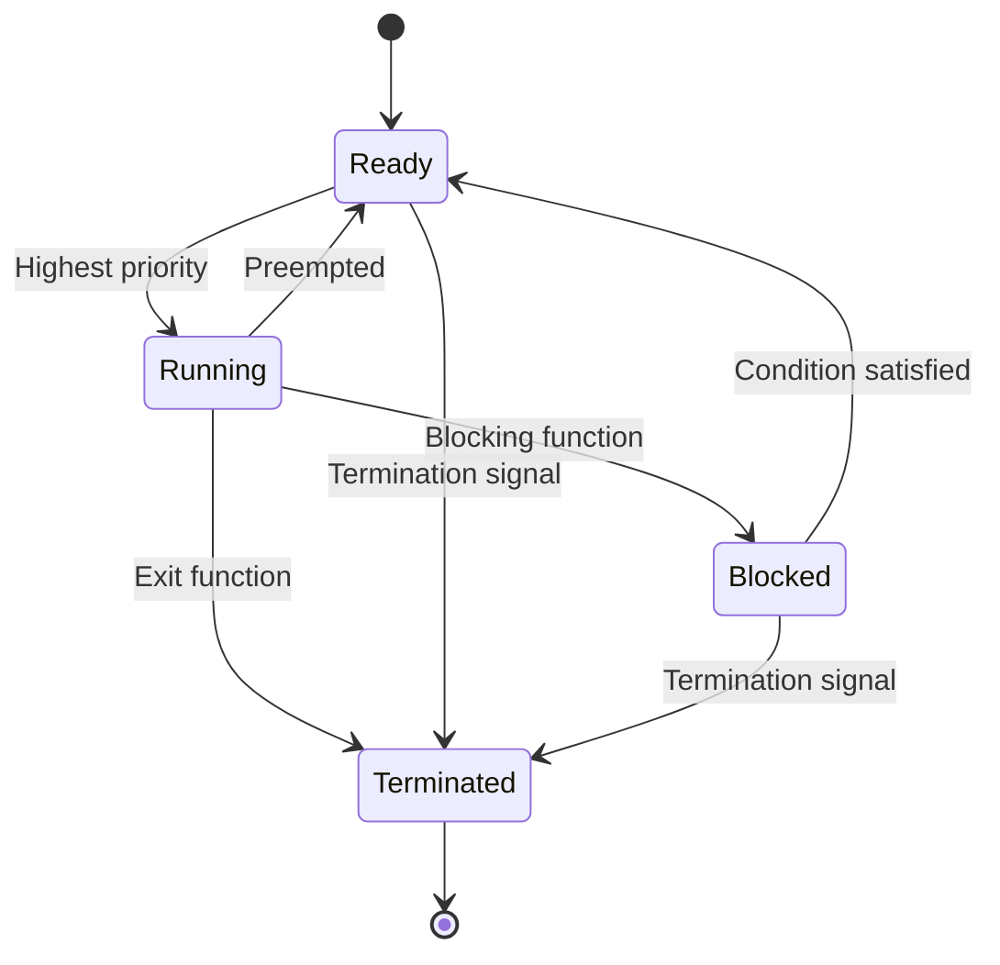

### Task States for the Notes of the Unit 3 - Real Time Kernel Basics in the Subject of Embedded Systems and Real Time Operating System

- A task is a unit of execution in a real time operating system (RTOS) that can be scheduled by the kernel.
- A task state is the condition of a task at a given point of time, which determines its readiness to run, its priority, and its resource allocation.
- The task state can be changed by the kernel, by the task itself, or by external events such as interrupts or signals.
- The common task states in a real time kernel are:

  - **Running**: The task is currently executing on the processor or is ready to execute on the processor. Only one task can be in the running state at a time on a single processor system. A task in the running state can be preempted by a higher priority task or by a timer interrupt. A task can also voluntarily relinquish the processor by calling a blocking function or a yield function.   
  - **Ready**: The task is not executing on the processor, but is eligible to run as soon as the processor becomes available. A task can enter the ready state from the running state, if it is preempted by a higher priority task or by a timer interrupt. A task can also enter the ready state from the blocked state, if the condition that caused it to block is satisfied. The ready tasks are usually maintained in a queue or a list, ordered by their priority. The kernel selects the highest priority task from the ready queue to run on the processor.   
  - **Blocked**: The task is not executing on the processor, and is not eligible to run until a certain condition is met. A task can enter the blocked state from the running state, if it calls a blocking function, such as waiting for a semaphore, a message, a timer, or an input/output operation. A task can also enter the blocked state from the ready state, if it receives a signal that causes it to suspend. The blocked tasks are usually maintained in separate queues or lists, depending on the reason for blocking. The kernel does not select any task from the blocked queue to run on the processor, until the condition that caused it to block is satisfied.   
  - **Terminated**: The task has completed its execution and has exited. A task can enter the terminated state from the running state, if it calls an exit function or returns from its main function. A task can also enter the terminated state from the ready state or the blocked state, if it receives a signal that causes it to terminate. The terminated tasks are usually removed from the system by the kernel, or by another task that reclaims their resources.   

- The following diagram shows the possible transitions between the task states in a real time kernel:

