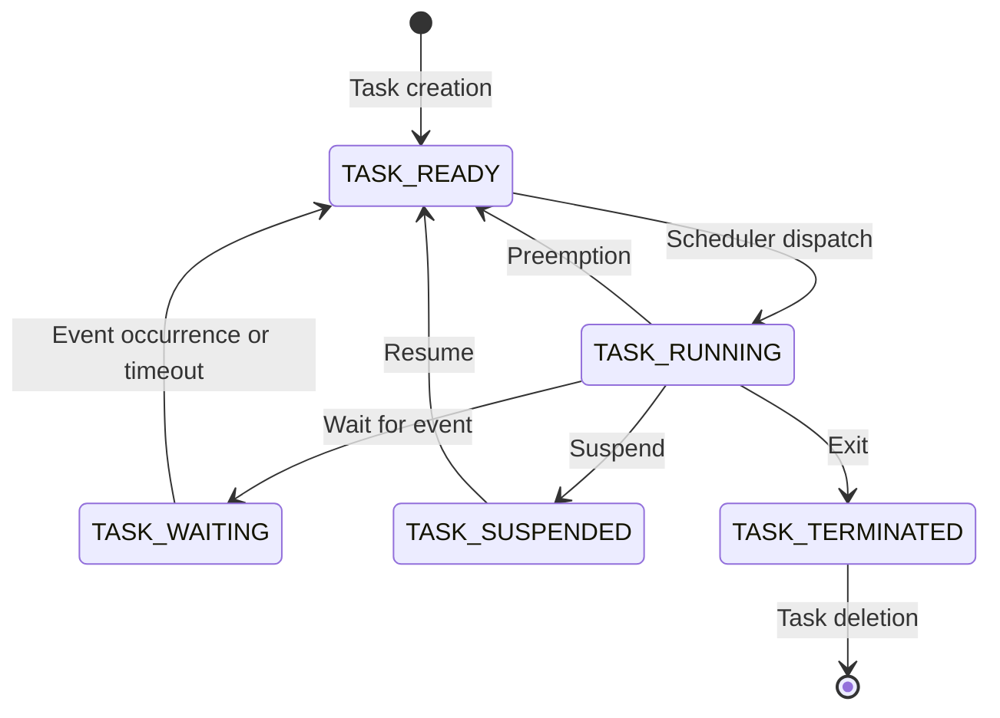

### Task states for the notes of the Unit 3 - REAL TIME KERNEL BASICS in the subject of EMBEDDED SYSTEMS AND REAL TIME OPERATING SYSTEM

- A task is a basic unit of execution in a real time operating system (RTOS). A task can be a process, a thread, or a coroutine, depending on the implementation of the RTOS.
- A task state is the condition of a task at a given point of time. It indicates whether the task is running, ready, waiting, suspended, or terminated.
- A task state can be changed by the RTOS scheduler, which decides which task to run next based on the task priorities, deadlines, and other factors.
- A task state can also be changed by the task itself, by calling certain RTOS functions or system calls, such as sleep, wait, signal, suspend, resume, or exit.
- The following are some common task states in a real time kernel:

  - **TASK_RUNNING**: The task is runnable, and it is either currently running or on a run queue waiting to run. This is the only possible state for a task executing in user space. It can also apply to a task in kernel space that is actively running.
  - **TASK_READY**: The task is runnable, but it is not on a run queue. It is waiting for the scheduler to assign it to a processor. This state can occur when a task is created, resumed, or unblocked by a signal or a timeout.
  - **TASK_WAITING**: The task is not runnable, and it is waiting for a certain event or condition to occur, such as an input/output operation, a semaphore, a message, or a timer. The task can specify a timeout value to limit the waiting time. If the event or condition occurs, or the timeout expires, the task becomes ready.
  - **TASK_SUSPENDED**: The task is not runnable, and it is suspended by another task or by itself. The task can only be resumed by another task or by itself. This state can be used to temporarily stop a task from executing, for example, for debugging or synchronization purposes.
  - **TASK_TERMINATED**: The task is not runnable, and it has completed its execution or has been killed by another task or by itself. The task can no longer be resumed or restarted. The task may still occupy some resources, such as memory or file descriptors, until it is deleted by another task or by itself.

- A task state diagram is a graphical representation of the possible states and transitions of a task in a real time kernel. The following is an example of a task state diagram:

