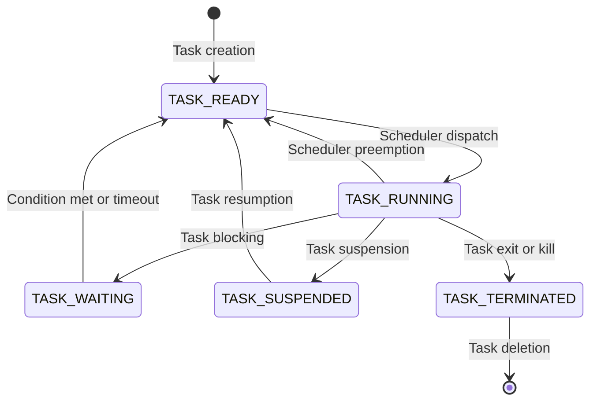

### Task States for the Notes of the Unit 3 - Real Time Kernel Basics in the Subject of Embedded Systems and Real Time Operating System

- A task is a basic unit of execution in a real time operating system (RTOS). A task can be a process, a thread, or a coroutine, depending on the implementation of the RTOS.
- A task state is the condition of a task at a given point of time. It indicates whether the task is running, ready, waiting, suspended, or terminated.
- A task state can be changed by the RTOS scheduler, which decides which task to run next based on the task priorities, deadlines, and other factors.
- A task state can also be changed by the task itself, by calling certain RTOS functions or by performing certain actions, such as blocking on a semaphore, waiting for a message, or exiting.
- The following are some common task states in a real time kernel:

  - **TASK_RUNNING**: The task is runnable, and it is either currently running or on a run queue waiting to run. This is the only possible state for a task executing in userspace. It can also apply to a task in kernel space that is actively running.
  - **TASK_READY**: The task is runnable, but it is not on a run queue. It is waiting for the scheduler to assign it a processor. This state can occur when a task is created, resumed, or unblocked by another task or an interrupt.
  - **TASK_WAITING**: The task is not runnable, and it is waiting for a certain condition to be satisfied, such as a timer expiration, a semaphore release, a message arrival, or an interrupt occurrence. The task can specify a timeout value for the wait operation, and if the condition is not met within the timeout, the task becomes ready.
  - **TASK_SUSPENDED**: The task is not runnable, and it is suspended by the RTOS or by itself. A suspended task does not consume any CPU time or resources, and it can only be resumed by another task or an interrupt. A task can suspend itself to save power, to synchronize with other tasks, or to avoid interference.
  - **TASK_TERMINATED**: The task is not runnable, and it has completed its execution or has been killed by the RTOS or by another task. A terminated task can be deleted by the RTOS or by itself, or it can be recycled for future use.

- The following diagram shows the possible transitions between the task states:

