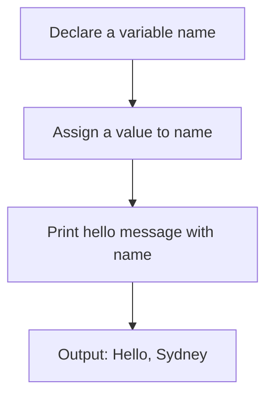

The topic is about how to read your name and print a hello message with your name using a programming language. This is a basic task that can be done in different ways depending on the language you choose. Here are some points to consider:

- You need to declare a variable to store your name as a string. A string is a sequence of characters enclosed in quotation marks, such as "Sydney".
- You need to assign a value to the variable using the assignment operator, which is usually =. For example, name = "Sydney".
- You need to use a function or a statement to print the hello message to the standard output, which is usually the screen. The function or statement may vary depending on the language, but it usually takes a string as an argument. For example, print("Hello, Sydney").
- You can use string concatenation to combine two or more strings into one. String concatenation is usually done with the + operator, but some languages may have different syntax. For example, print("Hello, " + name).
- You can also use string formatting to insert a variable into a string. String formatting is usually done with placeholders, such as %s or {}, and a format operator, such as % or .format(). For example, print("Hello, %s" % name) or print("Hello, {}".format(name)).
- Here is a diagram that shows the steps of reading your name and printing a hello message with your name in Python, which is a popular programming language:

