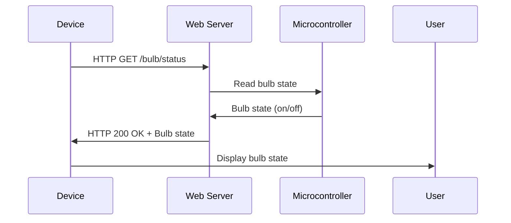

#### c) Get the status of a bulb at a remote place (on the LAN) through web.

To get the status of a bulb at a remote place (on the LAN) through web, the following steps are required:

- The bulb should be connected to a microcontroller that can communicate with the LAN using a wired or wireless interface. The microcontroller should also have a web server that can handle HTTP requests and responses.
- The microcontroller should be able to read the state of the bulb (on or off) using a digital input pin or a sensor, and send it as a response to the web server.
- The web server should have a unique IP address or a domain name that can be accessed from any device on the LAN or the internet.
- The device that wants to get the status of the bulb should send an HTTP GET request to the web server, specifying the path or the resource that corresponds to the bulb status.
- The web server should respond with an HTTP status code and a message body that contains the bulb status, either as plain text, JSON, XML, or any other format that can be parsed by the device.
- The device should display the bulb status to the user, either as text, image, or any other graphical representation.

The following diagram illustrates the process of getting the status of a bulb at a remote place (on the LAN) through web:

