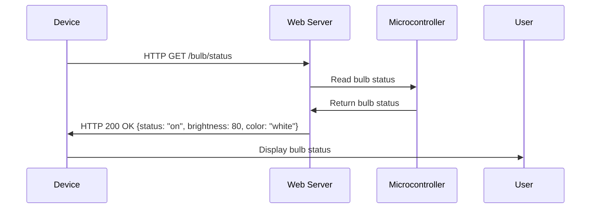

To get the status of a bulb at a remote place (on the LAN) through web, the following steps are required:

- The bulb should be connected to a microcontroller that can communicate with the LAN using a wired or wireless interface.
- The microcontroller should run a web server that can handle HTTP requests and send responses in a suitable format, such as JSON or XML.
- The web server should expose an endpoint that can return the current status of the bulb, such as on or off, brightness, color, etc.
- The device that wants to get the status of the bulb should be able to access the LAN and send an HTTP request to the web server's endpoint, using a web browser or a web client application.
- The device should receive the HTTP response from the web server and parse the data to display the status of the bulb.

The following diagram illustrates the process:

