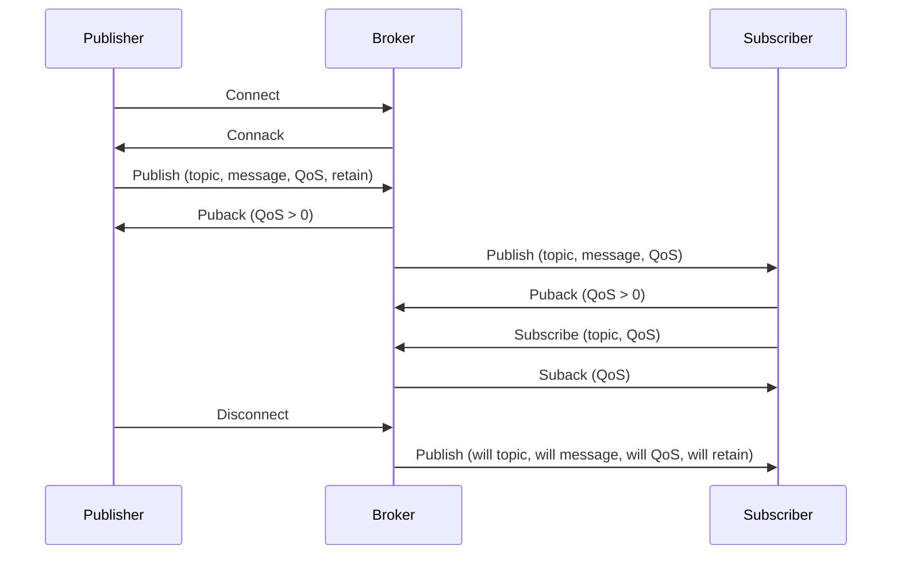

### MQTT

MQTT is a lightweight, open, and standards-based messaging protocol that is designed for machine-to-machine (M2M) communication or Internet of Things (IoT) scenarios. It employs a publish/subscribe communication pattern that enables low-bandwidth and reliable data exchange between remote devices and cloud services.

Some of the main features and benefits of MQTT are:

- It is based on the TCP/IP protocol stack and uses port 1883 by default.
- It supports three levels of quality of service (QoS) for message delivery: QoS 0 (at most once), QoS 1 (at least once), and QoS 2 (exactly once).
- It has a small code footprint and minimal network overhead, making it suitable for resource-constrained devices and networks.
- It allows for flexible and scalable communication between one-to-one, one-to-many, and many-to-many devices and applications.
- It supports various security mechanisms, such as TLS/SSL encryption, username/password authentication, and client certificates.

The basic components and concepts of MQTT are:

- Broker: A server that acts as a central hub for receiving and distributing messages between publishers and subscribers. It also handles the connection management, QoS, and security of the clients.
- Client: A device or application that connects to the broker and can either publish or subscribe to topics. A client can be both a publisher and a subscriber at the same time.
- Topic: A hierarchical string that identifies the subject or category of a message. For example, "home/temperature" or "car/status". Topics are case-sensitive and can use wildcards (+ and #) to match multiple levels.
- Message: A payload of data that is published by a client to a topic and delivered to the subscribers of that topic. A message can be any binary or text data, such as JSON, XML, or plain text.
- Publish: The action of sending a message to a topic by a client.
- Subscribe: The action of expressing interest in receiving messages from a topic by a client.
- Retain: A flag that can be set by a publisher to indicate that the broker should store the last message of a topic and deliver it to new subscribers.
- Will: A message that can be specified by a client when connecting to the broker, which will be published by the broker on behalf of the client if the client disconnects unexpectedly.

The following diagram illustrates the basic workflow of MQTT:

