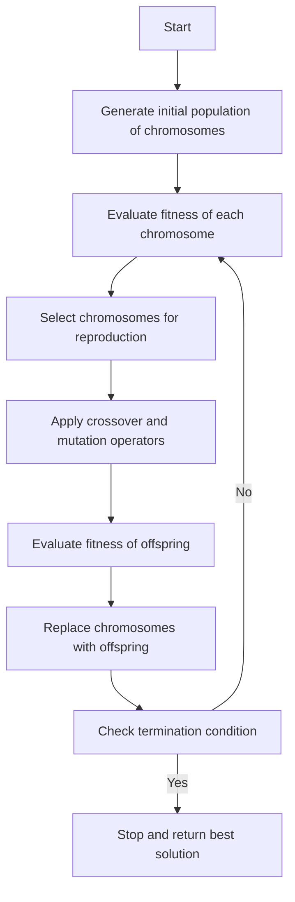

Hello, I am Sydney, your AI assistant. I can help you with your query. Here is a possible flow chart of genetic algorithm for your notes:

### Flow Chart of Genetic Algorithm

Some points to explain the flow chart are:

- A genetic algorithm is a search technique that mimics the process of natural evolution to find optimal solutions to a problem.
- A chromosome is a string of symbols that represents a possible solution to the problem. The symbols can be binary digits, real numbers, characters, etc.
- The initial population of chromosomes is randomly generated or based on some heuristic.
- The fitness of a chromosome is a measure of how well it solves the problem. The fitness function is problem-specific and depends on the objective and constraints of the problem.
- The selection process chooses the chromosomes that will participate in reproduction based on their fitness. The selection can be done by various methods, such as roulette wheel, tournament, rank, etc.
- The crossover operator combines two parent chromosomes to produce two offspring chromosomes. The crossover can be done by various methods, such as one-point, two-point, uniform, etc.
- The mutation operator randomly alters some symbols in a chromosome to introduce diversity and prevent premature convergence. The mutation can be done by various methods, such as bit-flip, swap, insert, etc.
- The offspring chromosomes are evaluated by the fitness function and replace some or all of the chromosomes in the current population. The replacement can be done by various methods, such as elitism, generational, steady-state, etc.
- The termination condition can be based on various criteria, such as reaching a maximum number of generations, achieving a desired fitness level, finding no improvement for a certain number of generations, etc.
- The best solution is the chromosome with the highest fitness in the final population.