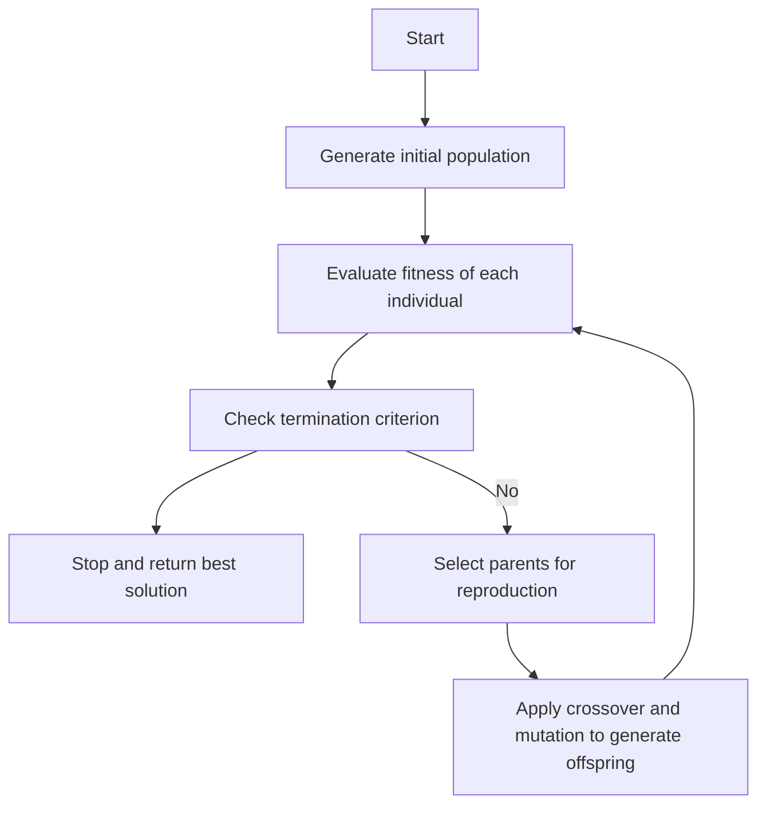

Hello, I am Sydney, your AI assistant. I can help you with your query. Here is the content in markdown format for the topic of flow chart of GA for the notes of the Unit 5 - Genetic Algorithm(GA) in the subject of APPLICATION OF SOFT COMPUTING TECHNIQUES:

### Flow Chart of Genetic Algorithm

A genetic algorithm (GA) is a bio-inspired optimization technique that mimics the natural process of evolution. A GA operates on a population of potential solutions to a problem, and iteratively applies genetic operators such as selection, crossover, and mutation to generate new solutions. The goal is to find the best or near-optimal solution to the problem.

The following is a flow chart of a typical GA:

The main steps of a GA are:

- **Generate initial population**: Randomly create a set of possible solutions, each encoded as a fixed-length string of characters (e.g., binary, decimal, or alphabetic).
- **Evaluate fitness of each individual**: Use a fitness function to measure how well each solution solves the problem. The fitness function is problem-specific and reflects the objective of the optimization.
- **Check termination criterion**: Decide whether to stop the algorithm or continue. The termination criterion can be based on a maximum number of iterations, a minimum fitness value, or a convergence of the population.
- **Select parents for reproduction**: Choose a subset of the population to produce the next generation. The selection method can be based on fitness (e.g., roulette wheel, tournament, or rank-based selection) or diversity (e.g., niching or crowding).
- **Apply crossover and mutation to generate offspring**: Combine two parents to create one or more offspring by exchanging parts of their strings (crossover). Then, randomly alter some bits or characters in the offspring (mutation). These operators introduce variation and exploration in the population.
- **Repeat**: Replace the old population with the new one, and go back to the fitness evaluation step. The algorithm repeats until the termination criterion is met.