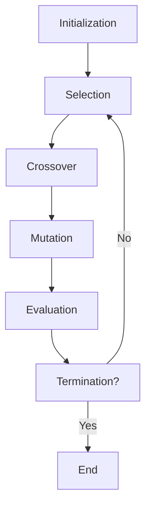

### Generational Cycle for Genetic Algorithm

- A genetic algorithm (GA) is a bio-inspired optimization technique that mimics the natural process of evolution and selection to find the best solutions to a given problem  .
- A GA works on the evolutionary generational cycle, which consists of the following steps  :
  - Initialization: A random population of candidate solutions (usually represented as binary strings) is generated. Each solution is assigned a fitness value based on how well it solves the problem.
  - Selection: A subset of the population is chosen to produce the next generation. The selection is based on the fitness values, such that fitter solutions have a higher chance of being selected.
  - Crossover: Pairs of selected solutions are combined to create new solutions by exchanging some of their bits. This introduces variation and recombination in the population.
  - Mutation: Some bits of the new solutions are randomly flipped to introduce further variation and exploration in the population.
  - Evaluation: The fitness values of the new solutions are calculated and compared with the previous ones. The best solutions are retained for the next generation.
  - Termination: The cycle is repeated until a stopping criterion is met, such as reaching a maximum number of generations, finding an optimal solution, or reaching a convergence threshold.
- The generational cycle of a GA can be illustrated by the following flowchart:

