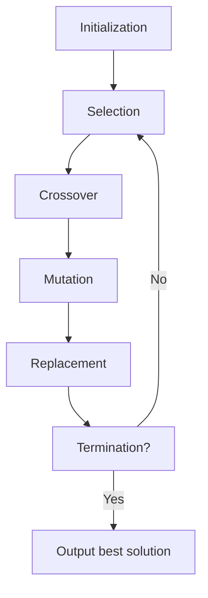

### Flow chart of GA

A flow chart is a graphical representation of the steps and operations involved in a process or an algorithm. A flow chart of GA shows how a genetic algorithm (GA) works to find an optimal or near-optimal solution to a given problem. A GA is a search-based optimization technique that is inspired by the principles of natural selection and evolution. A GA consists of the following main steps:

- Initialization: A population of candidate solutions (called chromosomes or individuals) is randomly generated or created using some heuristics. Each chromosome has a fitness value that measures how well it solves the problem.
- Selection: A subset of chromosomes is selected from the current population based on their fitness values. The selection process favors the fitter chromosomes, which have a higher chance of being chosen for the next generation. There are different methods of selection, such as roulette wheel, tournament, rank-based, etc.
- Crossover: Pairs of selected chromosomes are combined to produce new chromosomes (called offspring or children) by exchanging some of their genes. Crossover is a way of introducing diversity and exploration in the population. There are different types of crossover, such as one-point, two-point, uniform, etc.
- Mutation: Some of the genes in the offspring chromosomes are randomly altered to create new variations. Mutation is another way of introducing diversity and exploration in the population. There are different types of mutation, such as bit-flip, swap, insert, etc.
- Replacement: The offspring chromosomes replace some or all of the chromosomes in the current population, depending on the replacement strategy. The replacement process ensures that the population size remains constant and that the best chromosomes are preserved. There are different types of replacement, such as generational, steady-state, elitist, etc.
- Termination: The GA stops when a termination criterion is met, such as reaching a maximum number of generations, finding a satisfactory solution, or reaching a convergence state.

The following diagram shows a general flow chart of GA, adapted from :

