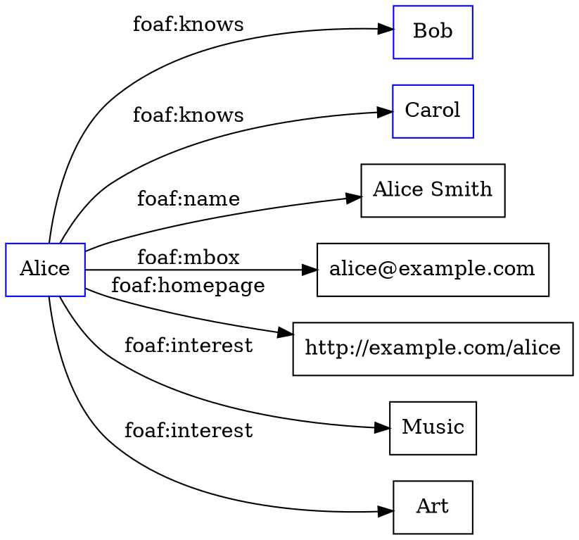

### Ontological representation of social individuals

- Ontology is a branch of philosophy that studies the nature and categories of being and existence.
- Ontology can also refer to a formal and explicit specification of a conceptualization of a domain of interest, using logic and symbols.
- Ontology-based knowledge representation is a technique that describes the individual instances and roles in the domain using predicates and relations.
- Social ontology is a subfield of ontology that deals with the basic entities, properties and kinds studied by the social sciences, such as social groups, social actions, social norms, social roles, etc.
- Social individuals are one kind of social entities, which are agents that have social identities, attributes, preferences, beliefs, goals, etc.
- Social individuals can be represented using ontologies that capture their personal information and their social network, such as the Friend-of-a-Friend (FOAF) ontology, which is an OWL-based format for representing people and their relationships.
- FOAF uses classes and properties to define the concepts and relations relevant to social individuals, such as foaf:Person, foaf:name, foaf:knows, foaf:interest, etc.
- FOAF can be used to create RDF graphs that describe the social individuals and their connections, using URIs as identifiers and literals as values.
- An example of a FOAF graph for a social individual named Alice is shown below:

