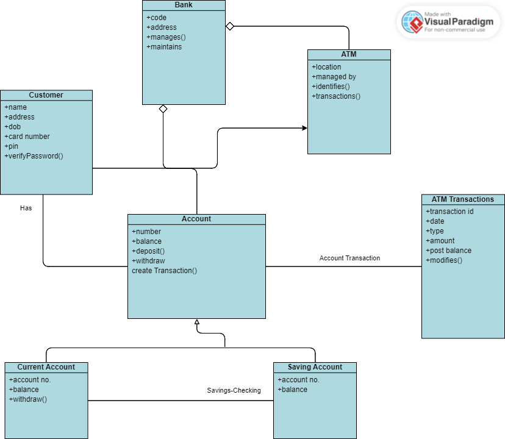

# Experiment 4

## Aim

Identify the classes. Classify them as weak and strong classes and draw the class diagram.

## Result

1. The classes identified are Customer, Bank, Account, ATM, Current Account, Savings Account, ATM Transaction.
2. The Strong classes are Customer, Bank, Account, ATM.
3. The Weak classes are Current Account, Savings Account, ATM Transaction.

## Diagram

