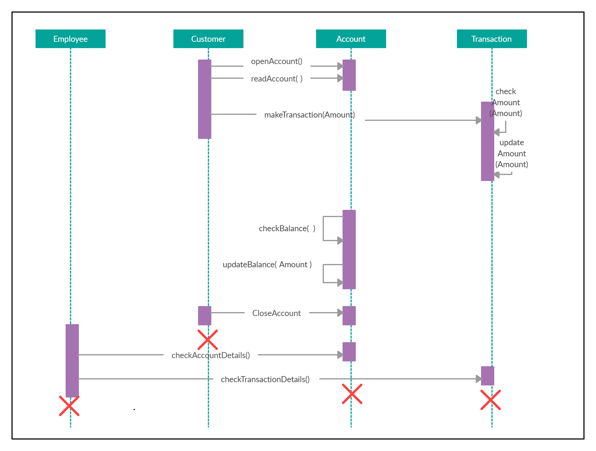
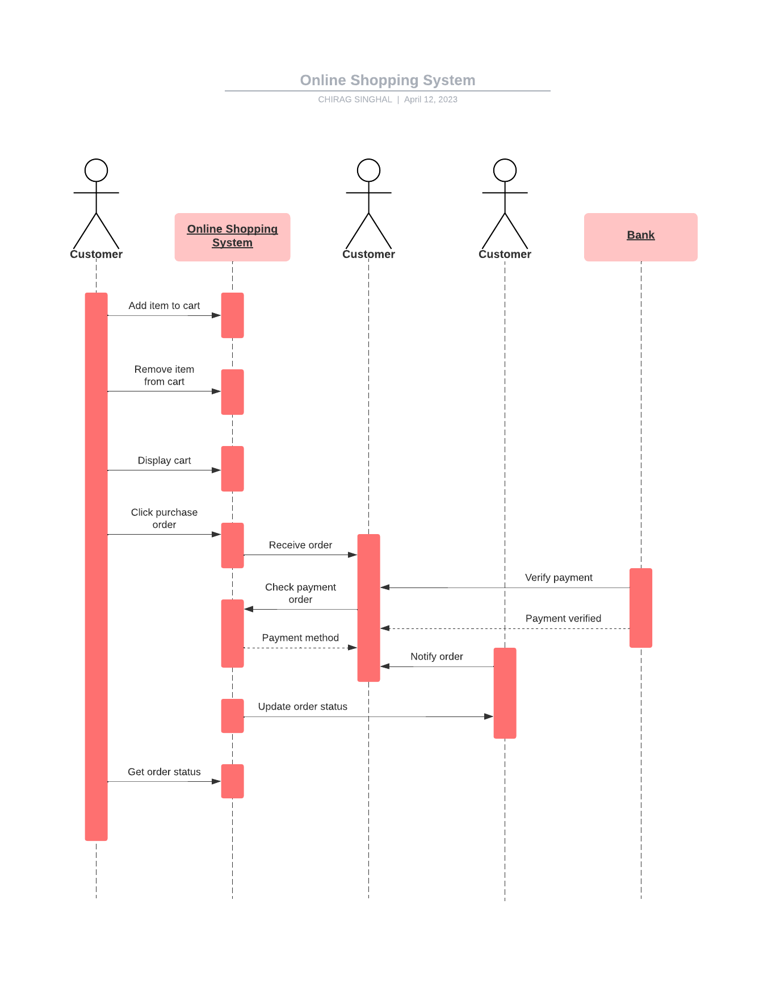

# Experiment 5

## Aim

Draw the sequence diagram for any two scenarios.

## Theory

The sequence diagram is a graphical representation of the interaction between objects in a system. It is a dynamic diagram that shows the sequence of messages exchanged between objects in a system. It is used to model the dynamic behavior of a system.

The sequence diagram for the scenario of Bank Management System and Online Shopping System is shown below.

## Diagram

### Bank Management System

### Online Shopping System

## Conclusion

The sequence diagram for the Bank Management System and Online Shopping System is drawn.
