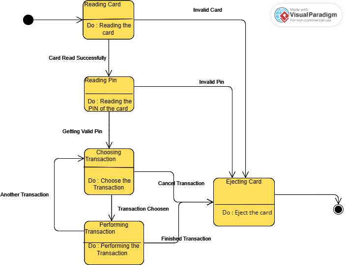

# Experiment 6

## Aim

Draw the state chart diagram.

## Theory

A statechart diagram shows a state machine. A state machine is a machine that can be in exactly one of a finite number of states at any given time. The state machine can change from one state to another in response to some external inputs; the change from one state to another is called a transition. A state machine is defined by a list of its states, its initial state, and the conditions for each transition.

## State Chart Diagram for a ATM Machine

## Conclusion

The state chart diagram is drawn for the given problem.