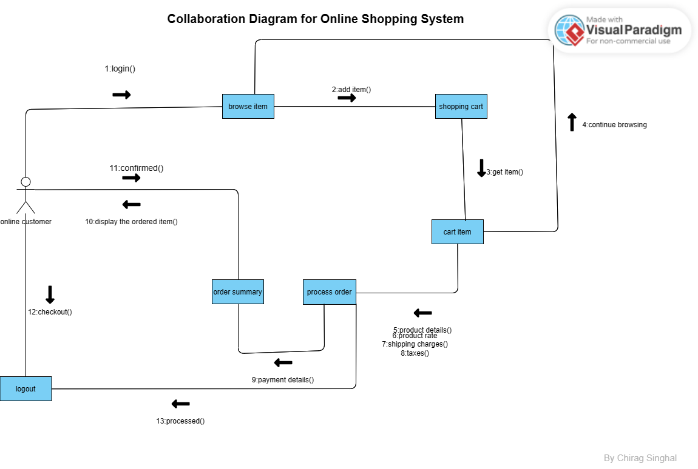
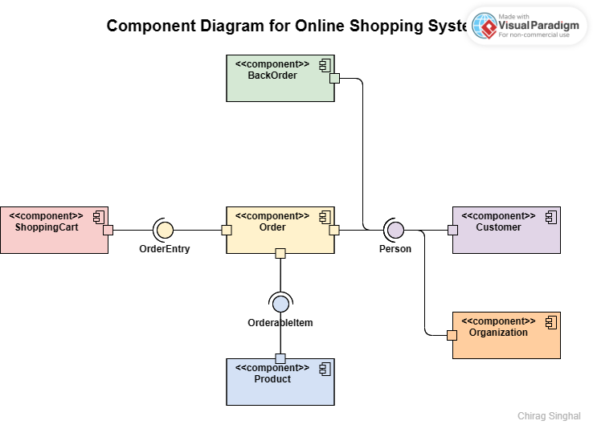
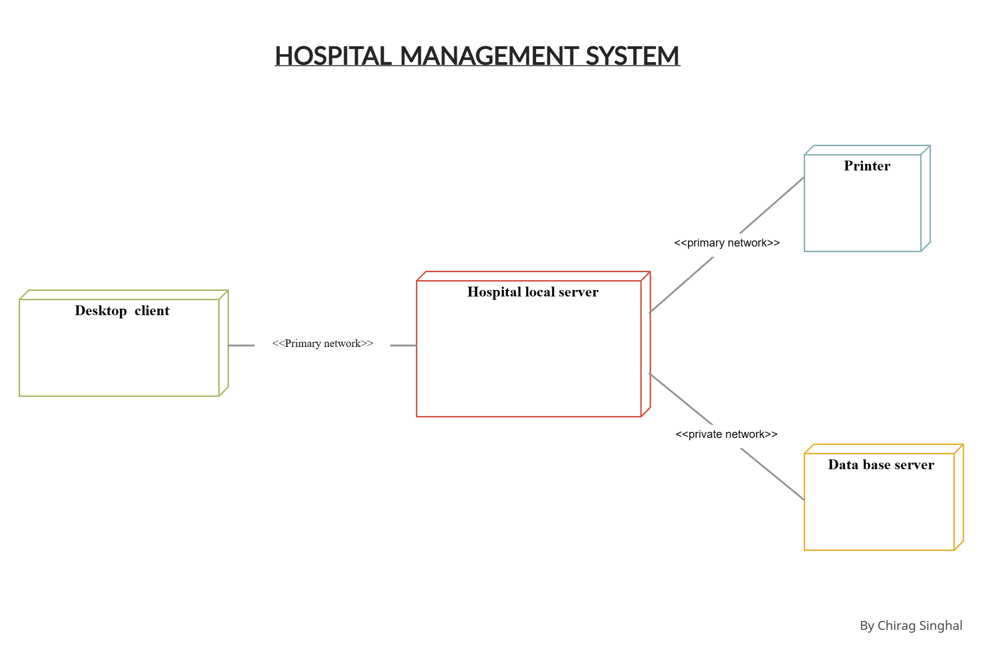
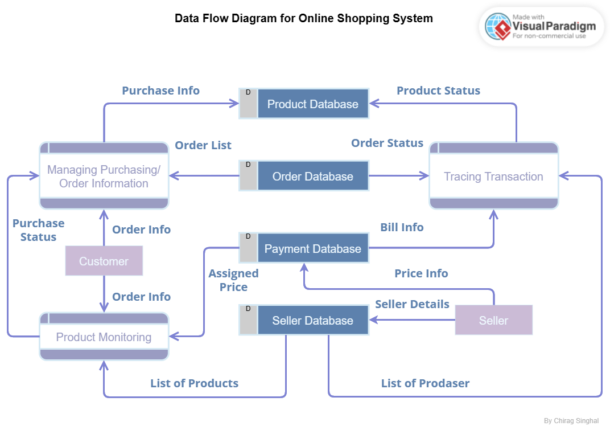

# Experiment 7

## Aim

Draw the collaboration diagram.

## Theory

Collaboration diagrams are used to visualize the organization of objects and their interaction. They are used to show the relationships between objects. They are also known as communication diagrams. They are used to visualize the organization of objects and their interaction. They are used to show the relationships between objects. They are also known as communication diagrams.

## Collaboration Diagram for Online Shopping System



## Conclusion

The collaboration diagram is drawn for the given problem.

<!-- next page -->

<div style="page-break-after: always;"></div>

# Experiment 8

## Aim

Draw the component diagram.

## Theory

A component diagram, also known as a UML component diagram, describes the organization and wiring of the physical components in a system. Component diagrams are often drawn to help model implementation details and double-check that every aspect of the system's required functions is covered by planned development.

## Component Diagram for Online Shopping System



## Conclusion

The component diagram is drawn for the given problem.

<!-- next page -->

<div style="page-break-after: always;"></div>

# Experiment 9

## Aim

Draw the deployment diagram for a given problem.

## Theory

A deployment diagram in the Unified Modeling Language models the physical deployment of artifacts on nodes. To describe a web site, for example, a deployment diagram would show what hardware components ("nodes") exist (e.g., a web server, an application server, and a database server), what software components ("artifacts") run on each node (e.g., web application, database), and how the different pieces are connected (e.g. JDBC, REST, RMI).

## Deployment Diagram for Hospital Management System



## Conclusion

The deployment diagram is drawn for the given problem.

<!-- next page -->

<div style="page-break-after: always;"></div>

# Experiment 10

## Aim

Draw Data Flow Diagram.

## Theory

A data flow diagram (DFD) is a graphical representation of the "flow" of data through an information system, modeling its process aspects. A DFD is often used as a preliminary step to create an overview of the system, which can later be elaborated. DFDs can also be used for the visualization of data processing (structured design). A DFD shows what kind of information will be input to and output from the system, where the data will come from and go to, and where the data will be stored. It does not show information about the timing of processes, or information about whether processes will operate in sequence or in parallel (which is shown on a flowchart).

## Data Flow Diagram for Online Shopping System



## Conclusion

The data flow diagram is drawn for the given problem.

<!-- next page -->

<div style="page-break-after: always;"></div>

# Experiment 11

## Aim

Write a program to compute cyclomatic complexity.

## Theory

Cyclomatic complexity is a software metric used to indicate the complexity of a program. It is a quantitative measure of the number of linearly independent paths through a program's source code. It was developed by Thomas J. McCabe, Sr. in 1976.

## Program Discrption

Here is the program take in the number of nodes and edges and then the number of connected components. Then it calculates the cyclomatic complexity. It uses the formula `V = E - N + 2P` where `E` is the number of edges, `N` is the number of nodes and `P` is the number of connected components.

## Program

```c
#include <stdio.h>

int main() {
    int nodes, edges, connected_components;
    printf("Enter the number of nodes: ");
    scanf("%d", &nodes);
    printf("Enter the number of edges: ");
    scanf("%d", &edges);
    printf("Enter the number of connected components: ");
    scanf("%d", &connected_components);
    int cyclomatic_complexity = edges - nodes + 2 * connected_components;
    printf("Cyclomatic Complexity: %d\n", cyclomatic_complexity);
    return 0;
}
```

## Output


## Conclusion

The cyclomatic complexity is calculated for the given problem.

<!-- next page -->

<div style="page-break-after: always;"></div>

# Experiment 12

## Aim

Write a program to compute Halstead’s Complexity.

## Theory

Halstead's complexity measures are software metrics introduced by Maurice Howard Halstead in 1977 as part of his treatise on establishing an empirical science of software development. They are based on mathematical theory of communication, and provide an empirically grounded theory of the complexity that is inherent in any software system.

## Program Discrption

Here is the program take in the number of operators and operands and then the number of distinct operators and operands. Then it calculates the Halstead’s Complexity.

## Program

```c
#include <stdio.h>
#include <math.h>
int main()

{
    // Declare variables
    float op_distinct, opd_distinct, op_total, opd_total;        // Number of distinct operators and operands
    float length, vocab_size, volume, level, difficulty, effort; // Halstead metrics
    float time;                                                  // Time to implement
    float k = 18;                                                // Stroud number (constant)

    // Accept input
    printf("\n Enter the value of number of distinct operators: ");
    scanf("%f", &op_distinct);
    printf("\n Enter the value of number of distinct operands: ");
    scanf("%f", &opd_distinct);
    printf("\n Enter the value of total number of operators: ");
    scanf("%f", &op_total);
    printf("\n Enter the value of total number of operands: ");
    scanf("%f", &opd_total);

    // Calculate Halstead metrics
    vocab_size = op_distinct + opd_distinct;                // Program vocabulary
    length = op_total + opd_total;                          // Program length
    volume = length * log(vocab_size);                      // Program volume
    level = (op_distinct / 2) * (opd_total / opd_distinct); // Program level
    difficulty = 1 / level;                                 // Program difficulty
    effort = volume * difficulty;                           // Program effort
    time = effort / k;                                      // Time to implement

    // Display output
    printf("\n Program Vocabulary: %f", vocab_size);
    printf("\n Program Length: %f", length);
    printf("\n Calculated Program Length: %f", volume);
    printf("\n Volume: %f", volume);
    printf("\n Difficulty: %f", difficulty);
    printf("\n Effort: %f", effort);
    printf("\n Time to implement: %f", time);

    // Return from main function with 0
    return 0;
}
```

## Output


## Conclusion

The Halstead’s Complexity is calculated for the given problem.
